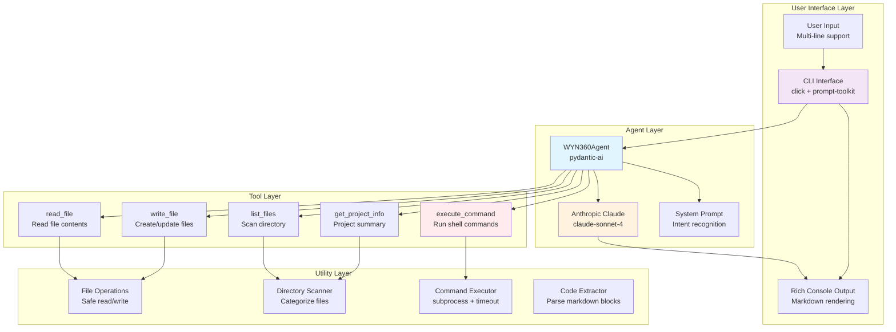

# WYN360 CLI

An intelligent AI coding assistant CLI tool powered by Anthropic Claude.

[](https://pypi.org/project/wyn360-cli/)
[](https://www.python.org/downloads/)
[](LICENSE)

## 🎯 Overview

WYN360 CLI is an AI-powered coding assistant that helps you build projects, generate code, and improve your codebase through natural language conversations. Built with pydantic-ai and Anthropic Claude, it provides intelligent file operations, command execution, and context-aware assistance.

## 🏗️ System Architecture



## 📦 Installation

```bash
pip install wyn360-cli
```

## 🚀 Quick Start

### 1. Set up your Anthropic API key (choose one method):

**Option 1: Environment variable**
```bash
export ANTHROPIC_API_KEY=your_key_here
```

**Option 2: .env file (recommended for local development)**
```bash
# Create a .env file in your project directory
echo "ANTHROPIC_API_KEY=your_key_here" > .env
```

**Option 3: Command-line argument**
```bash
wyn360 --api-key your_key_here
```

### 2. Run the CLI:
```bash
wyn360
```

### 3. Start chatting:
```
You: Build a Streamlit app for data visualization

WYN360: I'll create a Streamlit app for you...
[Generates complete code and saves to app.py]
```

## ✨ Features

### Core Capabilities
- 🤖 **Interactive AI Assistant** - Natural language conversations with Claude
- 📝 **Code Generation** - Generate production-ready Python code from descriptions
- 🔍 **Project Analysis** - Understand and improve existing codebases
- 📁 **Smart File Operations** - Context-aware file creation and updates
- ⚡ **Command Execution** - Run Python scripts, UV commands, shell scripts, any CLI tool
- ⌨️ **Multi-line Input** - Press Enter to submit, Shift+Enter for newline
- 🔒 **Safety First** - Confirmation prompts before executing commands

### Intelligent Features (v0.2.x)
- 🧠 **Intent Recognition** - Understands "update" vs "create new" from natural language
- 🔄 **Context-Aware Updates** - Reads files before modifying them
- 🔁 **Self-Correcting** - Smart retry mechanism with 3 attempts
- ⏱️ **Timeout Protection** - Prevents infinite loops (5 min default)
- 📊 **Comprehensive Output** - Captures stdout, stderr, and exit codes

## 🎮 Usage Examples

### Starting a New Project
```
You: Create a FastAPI app with authentication

WYN360:
- Generates main.py with FastAPI setup
- Creates auth middleware
- Adds example routes
- Provides setup instructions
```

### Updating Existing Code
```
You: Add logging to my script.py

WYN360:
- Reads current script.py
- Adds logging configuration
- Updates functions with log statements
- Preserves existing functionality
```

### Executing Commands
```
You: Run the analysis script

WYN360:
⚠️  About to execute command: python analysis.py
   Confirm execution? (y/N): y

✅ Command executed successfully
[Shows output]
```

## 🎯 Commands

| Command | Description |
|---------|-------------|
| `<message>` | Chat with the AI assistant |
| `Enter` | Submit your message |
| `Shift+Enter` | Add a new line (multi-line input) |
| `exit` or `quit` | End the session |

## 📚 Documentation

For comprehensive documentation including:
- Detailed use cases and examples
- Tool descriptions and capabilities
- UV workflow integration
- Best practices and tips

See: [USE_CASES.md](USE_CASES.md)

## 🛠️ Development & Testing

### Prerequisites

- Python >= 3.10
- Poetry (package manager)
- Anthropic API key

### Setting Up Development Environment

1. **Clone the repository:**
```bash
git clone https://github.com/yiqiao-yin/wyn360-cli.git
cd wyn360-cli
```

2. **Install Poetry** (if not already installed):
```bash
curl -sSL https://install.python-poetry.org | python3 -
```

3. **Install dependencies:**
```bash
poetry install
```

This will:
- Create a virtual environment
- Install all production dependencies from `pyproject.toml`
- Install development dependencies (pytest, pytest-asyncio, pytest-mock)
- Install the package in editable mode

### Running Tests

**Run all tests with verbose output:**
```bash
# Skip command confirmation prompts in tests
WYN360_SKIP_CONFIRM=1 poetry run pytest tests/ -v
```

**Run tests with short traceback:**
```bash
WYN360_SKIP_CONFIRM=1 poetry run pytest tests/ -v --tb=short
```

**Run specific test file:**
```bash
poetry run pytest tests/test_agent.py -v
```

**Run specific test class:**
```bash
poetry run pytest tests/test_utils.py::TestExecuteCommandSafe -v
```

**Run with coverage report:**
```bash
poetry run pytest tests/ --cov=wyn360_cli --cov-report=html
```

### Test Structure

```
tests/
├── __init__.py
├── test_agent.py          # Agent and tool tests (16 tests)
└── test_utils.py          # Utility function tests (29 tests)
                           # Total: 45 tests
```

### Expected Output

When all tests pass, you should see:
```
============================= test session starts ==============================
platform linux -- Python 3.10.12, pytest-8.4.2, pluggy-1.6.0
cachedir: .pytest_cache
rootdir: /home/workbench/wyn360-cli/wyn360-cli
configfile: pyproject.toml
plugins: asyncio-1.2.0, mock-3.15.1
collected 45 items

tests/test_agent.py::TestWYN360Agent::test_agent_initialization PASSED   [  2%]
tests/test_agent.py::TestWYN360Agent::test_system_prompt_contains_key_instructions PASSED [  4%]
...
tests/test_utils.py::TestExecuteCommandSafe::test_execute_python_script PASSED [100%]

============================== 45 passed in 1.55s
```

### Building and Publishing

**Build the package:**
```bash
poetry build
```

This creates:
- `dist/wyn360_cli-X.Y.Z.tar.gz` (source distribution)
- `dist/wyn360_cli-X.Y.Z-py3-none-any.whl` (wheel)

**Publish to PyPI:**
```bash
poetry publish
```

**Build and publish in one command:**
```bash
poetry build && poetry publish
```

### Version Management

Update version in these files:
- `pyproject.toml` - `version = "X.Y.Z"`
- `wyn360_cli/__init__.py` - `__version__ = "X.Y.Z"`
- `USE_CASES.md` - Update changelog and version number

### Development Workflow

1. **Create a feature branch:**
```bash
git checkout -b feature/your-feature-name
```

2. **Make changes and test:**
```bash
# Make your changes
WYN360_SKIP_CONFIRM=1 poetry run pytest tests/ -v
```

3. **Update version and documentation:**
```bash
# Update version in pyproject.toml, __init__.py, USE_CASES.md
```

4. **Commit and push:**
```bash
git add .
git commit -m "feat: your feature description"
git push origin feature/your-feature-name
```

5. **Build and publish:**
```bash
poetry build && poetry publish
git push origin main
```

## 🧪 Environment Variables

| Variable | Description | Default |
|----------|-------------|---------|
| `ANTHROPIC_API_KEY` | Anthropic API key (required) | None |
| `WYN360_SKIP_CONFIRM` | Skip command execution confirmations | `0` (disabled) |

Set `WYN360_SKIP_CONFIRM=1` to skip confirmation prompts (useful for testing or automation).

## 📋 Requirements

- Python >= 3.10
- Dependencies (automatically installed):
  - `click>=8.1.0` - CLI framework
  - `pydantic-ai>=0.0.1` - AI agent framework
  - `anthropic>=0.39.0` - Anthropic API client
  - `rich>=13.0.0` - Terminal formatting
  - `python-dotenv>=1.2.1` - Environment variable management
  - `prompt-toolkit>=3.0.0` - Advanced input handling

## 🤝 Contributing

Contributions are welcome! Please feel free to submit a Pull Request.

1. Fork the repository
2. Create your feature branch (`git checkout -b feature/amazing-feature`)
3. Run tests (`WYN360_SKIP_CONFIRM=1 poetry run pytest tests/ -v`)
4. Commit your changes (`git commit -m 'feat: add amazing feature'`)
5. Push to the branch (`git push origin feature/amazing-feature`)
6. Open a Pull Request

## 📄 License

This project is licensed under the MIT License - see the LICENSE file for details.

## 👤 Author

**Yiqiao Yin**
- Email: yiqiao.yin@wyn-associates.com
- GitHub: [@yiqiao-yin](https://github.com/yiqiao-yin)

## 🙏 Acknowledgments

- Built with [Anthropic Claude](https://www.anthropic.com/claude) - Advanced AI assistant
- Powered by [pydantic-ai](https://github.com/pydantic/pydantic-ai) - Python agent framework
- CLI framework by [Click](https://click.palletsprojects.com/)
- Terminal UI by [Rich](https://rich.readthedocs.io/)

## 🔗 Links

- **PyPI:** https://pypi.org/project/wyn360-cli/
- **GitHub:** https://github.com/yiqiao-yin/wyn360-cli
- **Documentation:** [USE_CASES.md](USE_CASES.md)
- **Get API Key:** https://console.anthropic.com/

---

**Current Version:** 0.2.3
**Last Updated:** November 2025
