# WYN360 CLI - System Architecture

This document provides a detailed overview of the WYN360 CLI system architecture, including all components, layers, and data flows.

**Version:** 0.3.21
**Last Updated:** January 2025

---

## 🏗️ Architecture Overview

WYN360 CLI is built on a modular, layered architecture that separates concerns and enables flexible extensibility.

```mermaid
graph TB
    subgraph "User Interface Layer"
        CLI[CLI Interface<br/>click + prompt-toolkit]
        Input[User Input<br/>Multi-line support<br/>Shift+Enter]
        Output[Rich Console Output<br/>Word-by-word streaming<br/>Markdown rendering]
        SlashCmd[Slash Commands<br/>/clear /history /save<br/>/load /tokens /model /config]
    end

    subgraph "Configuration Layer"
        UserConfig[User Config<br/>~/.wyn360/config.yaml<br/>Default model, instructions]
        ProjectConfig[Project Config<br/>.wyn360.yaml<br/>Project-specific context]
        ConfigMerge[Config Merger<br/>Combines user + project settings]
    end

    subgraph "Agent Layer"
        Agent[WYN360Agent<br/>pydantic-ai framework]
        ModelSwitch[Model Switcher<br/>haiku/sonnet/opus]
        Model[Anthropic Claude<br/>claude-sonnet-4 - default]
        Prompt[System Prompt<br/>Intent recognition<br/>Context awareness]
        History[Conversation History<br/>Context persistence<br/>Token tracking]
    end

    subgraph "Core Tools Layer"
        ReadFile[read_file<br/>Read file contents<br/>Size limits]
        WriteFile[write_file<br/>Create/update files<br/>Overwrite protection]
        ListFiles[list_files<br/>Scan directory<br/>Categorize by type]
        ProjectInfo[get_project_info<br/>Project summary<br/>File counts]
        ExecCmd[execute_command<br/>Run shell commands<br/>User confirmation<br/>Timeout protection]
    end

    subgraph "Extended Tools Layer (Phase 2)"
        GitStatus[git_status<br/>Show git status]
        GitDiff[git_diff<br/>Show changes]
        GitLog[git_log<br/>Commit history]
        GitBranch[git_branch<br/>List branches]
        SearchFiles[search_files<br/>Pattern search<br/>File type filtering]
        DeleteFile[delete_file<br/>Delete files safely]
        MoveFile[move_file<br/>Move/rename files]
        CreateDir[create_directory<br/>Create nested dirs]
    end

    subgraph "Builtin Tools Layer (Phase 11.1)"
        WebSearch[web_search<br/>Real-time web search<br/>Weather, URLs, current info<br/>$10 per 1K searches]
    end

    subgraph "GitHub Integration Tools (Phase 8.1)"
        CheckGHAuth[check_gh_authentication<br/>Check GitHub auth status]
        AuthGH[authenticate_gh<br/>Authenticate with token]
        GHCommit[gh_commit_changes<br/>Commit and push changes]
        GHCreatePR[gh_create_pr<br/>Create pull request]
        GHCreateBranch[gh_create_branch<br/>Create new branch]
        GHCheckoutBranch[gh_checkout_branch<br/>Switch branch]
        GHMergeBranch[gh_merge_branch<br/>Merge branches]
    end

    subgraph "Utility Layer"
        FileOps[File Operations<br/>Safe read/write<br/>Backup handling]
        Scanner[Directory Scanner<br/>Categorize files<br/>Ignore patterns]
        CmdExec[Command Executor<br/>subprocess + timeout<br/>Output capture]
        CodeExt[Code Extractor<br/>Parse markdown blocks<br/>Language detection]
        TokenTrack[Token Tracker<br/>Cost estimation<br/>Usage statistics]
        SessionMgr[Session Manager<br/>Save/Load JSON<br/>History persistence]
    end

    subgraph "Data Storage"
        SessionFiles[Session Files<br/>JSON format<br/>Conversation + tokens]
        ConfigFiles[Config Files<br/>YAML format<br/>User preferences]
    end

    Input --> CLI
    SlashCmd --> CLI
    CLI --> ConfigMerge
    UserConfig --> ConfigMerge
    ProjectConfig --> ConfigMerge
    ConfigMerge --> Agent
    CLI --> Agent
    Agent --> ModelSwitch
    ModelSwitch --> Model
    Agent --> Prompt
    Agent --> History

    Agent --> ReadFile
    Agent --> WriteFile
    Agent --> ListFiles
    Agent --> ProjectInfo
    Agent --> ExecCmd
    Agent --> GitStatus
    Agent --> GitDiff
    Agent --> GitLog
    Agent --> GitBranch
    Agent --> SearchFiles
    Agent --> DeleteFile
    Agent --> MoveFile
    Agent --> CreateDir
    Agent --> WebSearch
    Agent --> CheckGHAuth
    Agent --> AuthGH
    Agent --> GHCommit
    Agent --> GHCreatePR
    Agent --> GHCreateBranch
    Agent --> GHCheckoutBranch
    Agent --> GHMergeBranch

    ReadFile --> FileOps
    WriteFile --> FileOps
    ListFiles --> Scanner
    ProjectInfo --> Scanner
    ExecCmd --> CmdExec
    GitStatus --> CmdExec
    GitDiff --> CmdExec
    GitLog --> CmdExec
    GitBranch --> CmdExec
    SearchFiles --> FileOps
    DeleteFile --> FileOps
    MoveFile --> FileOps
    CreateDir --> FileOps
    CheckGHAuth --> CmdExec
    AuthGH --> CmdExec
    GHCommit --> CmdExec
    GHCreatePR --> CmdExec
    GHCreateBranch --> CmdExec
    GHCheckoutBranch --> CmdExec
    GHMergeBranch --> CmdExec

    WriteFile --> CodeExt
    History --> TokenTrack
    History --> SessionMgr
    SessionMgr --> SessionFiles
    ConfigMerge --> ConfigFiles

    Model --> Output
    CLI --> Output

    style Agent fill:#e1f5ff
    style Model fill:#fff3e0
    style CLI fill:#f3e5f5
    style ExecCmd fill:#ffebee
    style History fill:#e8f5e9
    style ConfigMerge fill:#fff9c4
```



---

## 📦 Component Descriptions

### User Interface Layer

**CLI Interface**
- Built with `click` for argument parsing
- Uses `prompt-toolkit` for advanced input handling
- Supports multi-line input with Shift+Enter
- Rich console output with markdown rendering

**Slash Commands**
- `/clear` - Clear conversation history and reset token counters
- `/history` - Display conversation history in table format
- `/save <file>` - Save current session to JSON file
- `/load <file>` - Load session from JSON file
- `/tokens` - Show detailed token usage statistics and costs
- `/model [name]` - Show current model or switch models
- `/config` - Show current configuration settings
- `/help` - Display help message with all commands

**Output Display**
- Word-by-word streaming simulation for better UX
- Syntax highlighting for code blocks
- Progress indicators (spinners) during processing
- Confirmation messages for command execution

### Configuration Layer

**User Configuration** (`~/.wyn360/config.yaml`)
- Default model selection
- Custom system instructions
- Preferences and settings
- Applies globally across all projects

**Project Configuration** (`.wyn360.yaml`)
- Project-specific instructions
- Technology stack context
- Custom commands
- Overrides user config for project

**Config Merger**
- Loads both user and project configs
- Merges settings with project taking precedence
- Combines custom instructions from both sources

### Agent Layer

**WYN360Agent**
- Core orchestrator using `pydantic-ai` framework
- Manages tool calling and execution
- Handles conversation flow and context
- Error handling and retry logic

**Model Switcher**
- Dynamic model selection during session
- Supports Haiku, Sonnet, and Opus models
- Cost-aware model recommendations
- Preserves conversation history across switches

**Anthropic Claude Models**
- **Haiku**: Fast, cheap for simple tasks ($0.25/$1.25 per M tokens)
- **Sonnet** (default): Balanced capability ($3.00/$15.00 per M tokens)
- **Opus**: Most capable for complex tasks ($15.00/$75.00 per M tokens)

**Conversation History**
- Maintains context across multiple interactions
- Tracks all user messages and assistant responses
- Sent with each API request for continuity
- Can be cleared with `/clear` command

**Token Tracking**
- Estimates token usage for input and output
- Calculates costs based on current model
- Cumulative tracking across session
- Displayed with `/tokens` command

### Core Tools Layer (Phase 1)

**read_file**
- Reads file contents safely
- Enforces size limits
- Returns error for non-existent files
- Used for understanding existing code

**write_file**
- Creates new files or updates existing ones
- Overwrite protection (requires explicit flag)
- Validates content size (100KB limit)
- Creates parent directories automatically

**list_files**
- Scans directory and lists files
- Categorizes by type (Python, text, config, data, other)
- Respects .gitignore patterns
- Returns structured summary

**get_project_info**
- Provides project overview
- File counts by category
- Technology detection
- Identifies blank projects

**execute_command**
- Runs shell commands safely
- User confirmation prompt with clear feedback
- Timeout protection (5 min default)
- Captures stdout, stderr, and exit code
- Environment variable support

### Extended Tools Layer (Phase 2)

**Git Operations**
- `git_status` - Show working tree status
- `git_diff` - View changes (all or specific file)
- `git_log` - Display commit history
- `git_branch` - List all branches

**Code Search**
- `search_files` - Pattern matching across files
- Supports regex patterns
- File type filtering (*.py, *.txt, etc.)
- Line number reporting
- Smart truncation (first 100 matches)

**File Management**
- `delete_file` - Delete files with safety checks
- `move_file` - Move/rename files with directory creation
- `create_directory` - Create nested directory structures

### Builtin Tools Layer (Phase 11.1)

**Web Search (pydantic-ai WebSearchTool)**
- Real-time internet search using Claude's native web_search_20250305 tool
- Integrated via pydantic-ai's `builtin_tools` parameter
- Configured with `max_uses=5` to control costs

**Use Cases:**
1. **Weather Queries**
   - User asks: "What's the weather in [location]?"
   - Asks for location if not provided
   - Searches and displays current weather with source

2. **Website Reading**
   - User provides URL: "Read https://example.com"
   - Fetches and summarizes website content
   - Displays key points with proper citations

3. **Current Information**
   - Latest documentation and package updates
   - Recent news and events
   - Real-time data and trends
   - Examples: "What's new in Python 3.13?", "Latest React features"

**Cost Structure:**
- $10.00 per 1,000 searches
- Plus standard token costs for input/output
- Limited to 5 searches per session by default

**Integration:**
- Separate from custom @tool decorated functions
- Works alongside 19 existing custom tools
- No conflicts with file operations or git tools
- Invoked automatically by Claude when needed for current information

### GitHub Integration Tools (Phase 8.1)

**Authentication Tools**
- `check_gh_authentication` - Check GitHub CLI authentication status
  - Checks GH_TOKEN or GITHUB_TOKEN environment variables
  - Auto-authenticates if token found
  - Returns username if authenticated

- `authenticate_gh(token)` - Authenticate with GitHub token
  - Validates token format (ghp_* or github_pat_*)
  - Stores token in environment
  - Uses gh CLI login command
  - Required scopes: repo, workflow

**Repository Operations**
- `gh_commit_changes(message, push)` - Commit and push changes
  - Stages all changes with 'git add -A'
  - Commits with provided message
  - Optionally pushes to remote (default: True)
  - Checks for git repo and remote configuration

- `gh_create_pr(title, body, base_branch)` - Create pull request
  - Creates PR using gh CLI
  - Validates not on base branch (e.g., main)
  - Returns PR URL on success
  - Handles existing PR detection

**Branch Management**
- `gh_create_branch(branch_name, checkout)` - Create new branch
  - Validates branch name (no spaces)
  - Optionally switches to new branch (default: True)
  - Checks for existing branch with same name

- `gh_checkout_branch(branch_name)` - Switch to existing branch
  - Checks for uncommitted changes
  - Returns error if branch doesn't exist
  - Safe branch switching with status checks

- `gh_merge_branch(source_branch, target_branch)` - Merge branches
  - Merges source into target (default: current branch)
  - Checks for uncommitted changes
  - Detects and reports merge conflicts
  - Supports fast-forward and 3-way merges

**Common Workflows:**

1. **Commit and Push:**
   ```
   User: "Commit these changes"
   → check_gh_authentication() → gh_commit_changes("message", push=True)
   ```

2. **Create Feature Branch:**
   ```
   User: "Create branch feature/auth"
   → gh_create_branch("feature/auth", checkout=True)
   ```

3. **Open Pull Request:**
   ```
   User: "Create PR for my changes"
   → check_gh_authentication() → gh_create_pr("title", "body", "main")
   ```

4. **Merge Feature:**
   ```
   User: "Merge feature/auth into main"
   → gh_merge_branch("feature/auth", "main")
   ```

**Integration Notes:**
- All tools use execute_command_safe with user confirmation
- GitHub CLI (gh) must be installed on system
- Uses existing git repository in current directory
- Authentication persists across session
- Follows same pattern as HuggingFace integration

### Utility Layer

**File Operations**
- Safe file reading with encoding detection
- Safe file writing with backup handling
- Directory creation with parent path support
- Error handling for permissions and I/O issues

**Directory Scanner**
- Recursive file traversal
- File categorization by extension
- Ignore pattern support (.gitignore, __pycache__, etc.)
- Efficient for large codebases

**Command Executor**
- Subprocess management with timeout
- Output streaming and capture
- Working directory support
- Environment variable injection
- Exit code handling

**Code Extractor**
- Parses markdown code blocks
- Language detection from fence markers
- Multiple block extraction
- Used for auto-saving generated code

**Token Tracker**
- Estimates tokens using char count heuristic
- Tracks input and output separately
- Calculates costs based on model pricing
- Cumulative session tracking
- Per-message breakdown

**Session Manager**
- Saves conversations to JSON format
- Includes conversation history and token stats
- Loads previous sessions
- Preserves context across sessions

### Data Storage

**Session Files** (JSON)
- Conversation history (user + assistant messages)
- Token usage statistics (input, output, cost)
- Timestamp and metadata
- Can be loaded to resume sessions

**Config Files** (YAML)
- User preferences in `~/.wyn360/config.yaml`
- Project settings in `.wyn360.yaml`
- Model selection, custom instructions, etc.

---

## 🔄 Data Flow Examples

### Simple File Read
```
User: "Show me app.py"
  → CLI → Agent → read_file tool
  → FileOps reads file
  → Content returned to Model
  → Model generates response
  → Output displayed word-by-word
```

### Command Execution with Confirmation
```
User: "Run the tests"
  → CLI → Agent → execute_command tool
  → Confirmation prompt displayed
  → User presses 'y' + Enter
  → "✓ Confirmed. Executing command..." displayed
  → CmdExec runs command with timeout
  → Output captured (stdout + stderr)
  → Results returned to Model
  → Model summarizes results
  → Output displayed word-by-word
```

### Multi-Tool Workflow
```
User: "Create a FastAPI app"
  → CLI → Agent → Model analyzes request
  → Model calls write_file("app.py", code)
  → FileOps writes file
  → Model calls write_file("requirements.txt", deps)
  → FileOps writes file
  → Model generates response explaining what was created
  → Output displayed word-by-word
  → Conversation + tokens saved to history
```

### Model Switch Mid-Session
```
User: "/model haiku"
  → CLI → SlashCmd handler
  → Agent → ModelSwitch
  → New model instantiated (claude-3-5-haiku)
  → Conversation history preserved
  → Confirmation message displayed
```

### Session Save/Load
```
User: "/save my_session.json"
  → CLI → SlashCmd handler
  → SessionMgr serializes conversation + tokens
  → JSON file written
  → Confirmation message

Later...
User: "/load my_session.json"
  → CLI → SlashCmd handler
  → SessionMgr reads JSON file
  → Conversation history restored
  → Token counters restored
  → Confirmation message
```

---

## 🚀 Key Features by Phase

### Phase 1: Context Management (v0.2.8)
- ✅ Conversation history persistence
- ✅ Token tracking and cost monitoring
- ✅ Session save/load functionality
- ✅ Slash commands (/clear, /history, /save, /load, /tokens, /help)

### Phase 2: Additional Tools (v0.2.9)
- ✅ Git operations (status, diff, log, branch)
- ✅ Code search across files with pattern matching
- ✅ File management (delete, move, create dirs)
- ✅ 8 new tools for enhanced project management

### Phase 3: Model Selection (v0.3.0)
- ✅ Dynamic model switching (haiku/sonnet/opus)
- ✅ Model information display with pricing
- ✅ /model command for mid-session changes
- ✅ Cost-aware recommendations

### Phase 4: Configuration (v0.3.1)
- ✅ User configuration file (~/.wyn360/config.yaml)
- ✅ Project configuration file (.wyn360.yaml)
- ✅ Custom instructions and project context
- ✅ /config command to view settings

### Phase 5: Streaming Responses (v0.3.2-v0.3.15)
- ✅ Word-by-word output simulation for smooth UX
- ✅ Real-time feedback and progress visibility
- ✅ Immediate command execution confirmation (v0.3.14)
- ✅ No text duplication (fixed in v0.3.13)

### Phase 11.1: Web Search (v0.3.21, Enhanced v0.3.23)
- ✅ Real-time web search using Claude's native web_search_20250305 tool
- ✅ Weather queries with location handling
- ✅ Website content fetching and summarization
- ✅ Current information retrieval (docs, news, trends)
- ✅ **Resource finding** - GitHub repos, libraries, tutorials (v0.3.23)
- ✅ Cost-controlled with 5 searches per session max
- ✅ Integrated via pydantic-ai's WebSearchTool builtin
- ✅ **Upgraded to pydantic-ai 1.13.0** for improved stability (v0.3.23)
- ✅ **Enhanced system prompt** with clearer intent examples (v0.3.23)

### Phase 12: Browser Use / Direct Website Fetching (v0.3.24)

**Phase 12.1: Basic Website Fetching**
- ✅ Direct URL fetching using crawl4ai (LLM-optimized web crawler)
- ✅ Full DOM extraction with JavaScript execution support
- ✅ Automatic HTML → Markdown conversion for LLM consumption
- ✅ Smart truncation preserving document structure
- ✅ Configurable max tokens (default: 50,000)
- ✅ URL validation and error handling
- ✅ Integration with agent tool system

**Phase 12.2: TTL-Based Caching**
- ✅ Automatic caching with 30-minute TTL (configurable)
- ✅ Gzip compression for efficient storage
- ✅ Cache directory: `~/.wyn360/cache/fetched_sites/`
- ✅ Automatic cleanup of expired entries
- ✅ Size-based cache management (max 100MB)
- ✅ Cache hit/miss tracking
- ✅ JSON index for metadata management

**Phase 12.3: User-Controlled Cache Management**
- ✅ `show_cache_stats` - View cache statistics and cached URLs
- ✅ `clear_website_cache` - Clear specific URL or all cache
- ✅ Cache age tracking and expiration display
- ✅ User-friendly cache information
- ✅ Integration with agent conversation flow

**Technical Architecture:**
- **crawl4ai**: Playwright-based async web crawler
- **browser_use.py**: Core fetching, caching, and truncation logic
- **WebsiteCache**: TTL-based cache with automatic cleanup
- **Smart Truncation**: Preserves headers, keeps first 70% + last 30%
- **Token Estimation**: ~4 chars per token for truncation decisions

**Configuration (config.yaml):**
```yaml
browser_use:
  max_tokens: 50000  # Configurable per user
  truncate_strategy: "smart"  # smart, head, tail
  cache:
    enabled: true
    ttl: 1800  # 30 minutes
    max_size_mb: 100
```

**Key Differentiators from WebSearchTool:**
- **WebSearchTool**: Searches for keywords → Returns top 5 results
- **fetch_website**: Fetches specific URL → Returns full page content
- **Use Case Split**: Search (find things) vs Fetch (get specific pages)

### Phase 8.1: GitHub Integration (v0.3.22)
- ✅ GitHub authentication with token management (GH_TOKEN/GITHUB_TOKEN)
- ✅ Commit and push changes directly from CLI
- ✅ Create pull requests with title, body, and base branch
- ✅ Branch management: create, checkout, merge branches
- ✅ Auto-authentication from environment variables
- ✅ Integration with GitHub CLI (gh) for seamless operations
- ✅ 7 new tools for complete GitHub workflow management

---

## 🎯 Design Principles

1. **Safety First**: Confirmation prompts, overwrite protection, timeout limits
2. **User Control**: Slash commands, model switching, configuration options
3. **Transparency**: Token tracking, cost visibility, clear error messages
4. **Context Awareness**: Conversation history, project configs, intent recognition
5. **Extensibility**: Modular architecture, easy to add new tools
6. **Performance**: Efficient file operations, smart caching, timeout protection

---

## 📈 Future Enhancements

See [ROADMAP.md](ROADMAP.md) for planned features including:
- Phase 6: Advanced Workflows (multi-file refactoring, test generation)
- Phase 7: Integration Features (GitHub, databases)
- Phase 8: Safety & Quality (validation, backups, undo/rollback)
- Phase 9: Monitoring & Analytics (usage dashboards, performance metrics)
- Phase 10: Collaboration Features (session sharing, prompt library)

---

## 📚 Related Documentation

- [README.md](README.md) - Quick start and basic usage
- [USE_CASES.md](USE_CASES.md) - Detailed examples and use cases
- [ROADMAP.md](ROADMAP.md) - Feature roadmap and expansion ideas
- [ROADMAP_BROWSERUSE.md](ROADMAP_BROWSERUSE.md) - Browser use implementation roadmap
- [COST.md](COST.md) - Cost analysis and optimization strategies

---

**Version:** 0.3.24
**Last Updated:** January 2025
**Maintained by:** Yiqiao Yin (yiqiao.yin@wyn-associates.com)
