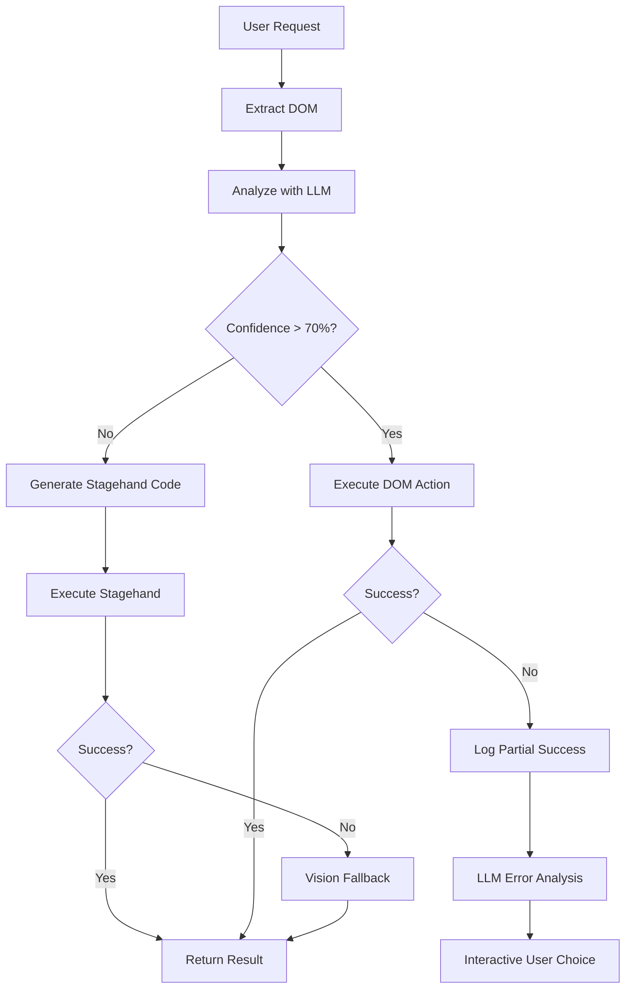

# WYN360 CLI - DOM-First Browser Automation Enhancement Roadmap

**Status:** 🚧 In Development
**Priority:** HIGH - Performance & Cost Optimization
**Start Date:** November 24, 2025
**Target Completion:** December 2025

---

## 📋 Executive Summary

This roadmap outlines the enhancement of WYN360 CLI's autonomous browser automation capabilities by implementing a **DOM-first approach with intelligent fallbacks**. The goal is to replace the current expensive and slow vision-based system with a faster, cheaper, and more reliable solution.

### Current Problem

**Existing Flow:** Screenshot → Claude Vision API → JSON Decision → Playwright Action
- **Cost Issue:** ~$15/1M tokens for vision API calls
- **Speed Issue:** Multiple screenshots per action sequence
- **Efficiency Issue:** Image processing latency

### Enhanced Solution

**New Flow:** DOM Analysis → LLM Decision → Stagehand Fallback → Vision Fallback → Playwright Execution
- **Cost Savings:** 80-90% reduction in API costs
- **Speed Improvement:** 44%+ faster execution
- **Reliability:** Self-healing with multiple fallback strategies

---

## 🎯 Implementation Strategy

### **Phase 1: DOM-First Analysis** ✅ Planned
**Goal:** Extract DOM structure and let LLM make decisions without vision

#### Tasks:
- [ ] 1.1 Create DOM extraction utility
- [ ] 1.2 Implement `analyze_dom` pydantic-ai tool
- [ ] 1.3 Design DOM-to-action decision logic
- [ ] 1.4 Add confidence scoring system
- [ ] 1.5 Integrate with existing browser tools
- [ ] 1.6 Add token counting for DOM analysis

#### Technical Requirements:
- **Full DOM Structure:** Extract complete DOM tree with interactive elements
- **Element Attributes:** Include id, class, aria-labels for better LLM decisions
- **Pydantic-AI Integration:** New tools that work alongside existing browser capabilities
- **Token Tracking:** Count tokens for DOM analysis in slash command breakdown

#### Success Criteria:
- ✅ DOM extraction covers 90%+ of interactive elements
- ✅ LLM can make actionable decisions from DOM data
- ✅ Confidence scoring accurately predicts success probability
- ✅ Token usage tracked and displayed in `/tokens` command

---

### **Phase 2: Stagehand Fallback Integration** ⏳ Planned
**Goal:** Dynamic Stagehand code generation for complex scenarios

#### Tasks:
- [ ] 2.1 Install and configure stagehand-py
- [ ] 2.2 Create Stagehand code generation system
- [ ] 2.3 Implement dynamic execution pipeline
- [ ] 2.4 Add pattern caching mechanism
- [ ] 2.5 Design fallback trigger logic
- [ ] 2.6 Add token counting for Stagehand operations

#### Technical Requirements:
- **Dynamic Code Generation:** Generate Stagehand code on-the-spot based on user query + DOM
- **Execution Pipeline:** Safe execution of generated Stagehand code
- **Pattern Caching:** Cache successful Stagehand patterns for reuse
- **Fallback Logic:** Trigger when DOM confidence score below threshold

#### Success Criteria:
- ✅ Dynamic Stagehand code generation works for complex scenarios
- ✅ Pattern caching reduces repeated API calls
- ✅ Fallback triggers appropriately based on confidence thresholds
- ✅ All operations tracked in token counting system

---

### **Phase 3: Vision Fallback Integration** ⏳ Planned
**Goal:** Maintain vision capabilities as final fallback for complex visual tasks

#### Tasks:
- [ ] 3.1 Preserve existing vision-based system
- [ ] 3.2 Implement transparent tool interface
- [ ] 3.3 Add intelligent routing between approaches
- [ ] 3.4 Optimize vision usage for edge cases only
- [ ] 3.5 Unified error handling across all approaches

#### Technical Requirements:
- **Transparent Interface:** Same tool interface for DOM → Stagehand → Vision
- **Intelligent Routing:** Automatic selection of best approach
- **Edge Case Handling:** Vision reserved for complex visual understanding
- **Unified Experience:** Seamless switching between approaches

#### Success Criteria:
- ✅ All three approaches accessible through same tool interface
- ✅ Vision usage reduced to <10% of browser automation tasks
- ✅ Seamless user experience regardless of approach used
- ✅ Complete token tracking across all approaches

---

### **Phase 4: Browser Management & UX** ⏳ Planned
**Goal:** Enhanced browser control and user experience

#### Tasks:
- [ ] 4.1 Implement `--show-browser` flag
- [ ] 4.2 Add headless mode as default
- [ ] 4.3 Unified Playwright browser instance management
- [ ] 4.4 Interactive error handling system
- [ ] 4.5 Update documentation and README

#### Technical Requirements:
- **Browser Control:** Headless by default, `--show-browser` flag for debugging
- **Instance Management:** Same Playwright browser across all approaches
- **Interactive Errors:** When partial success occurs, show error + LLM recommendations
- **User Control:** Let user decide next steps after errors

#### Success Criteria:
- ✅ Browser visibility controlled by user preference
- ✅ Single browser instance shared across all approaches
- ✅ Interactive error recovery with LLM assistance
- ✅ Clear documentation for all browser flags

---

## 🔧 Technical Architecture

### **Tool Interface Design**

```python
# New pydantic-ai tools in WYN360Agent:

@tool
async def browse_page_intelligently(
    self,
    ctx: RunContext[None],
    url: str,
    task: str,  # "login with user@example.com", "find product price"
    strategy: str = "auto"  # "dom", "stagehand", "vision", "auto"
) -> str:
    """
    Browse webpage intelligently using DOM-first approach with fallbacks
    """

@tool
async def extract_page_data(
    self,
    ctx: RunContext[None],
    url: str,
    schema: dict,  # {"title": str, "price": float, "availability": bool}
    strategy: str = "auto"
) -> dict:
    """
    Extract structured data from webpage using best available method
    """
```

### **Decision Flow Logic**



### **Token Tracking Enhancement** ✅ IMPLEMENTED

```python
# Enhanced /tokens command breakdown:
{
    "total_tokens": 15420,
    "costs": {
        "total": "$0.23",
        "dom_automation": "$0.05",      # ✅ Implemented
        "stagehand_generation": "$0.08", # Phase 2
        "vision_fallback": "$0.10"
    },
    "dom_automation": {                 # ✅ Implemented
        "total_operations": 12,
        "dom_analysis_count": 8,
        "dom_action_count": 3,
        "intelligent_browse_count": 1,
        "total_input_tokens": 3420,
        "total_output_tokens": 1580,
        "total_cost": "$0.05"
    }
}
```

---

## 🎪 Integration Points

### **Existing Browser Tools**
- **Keep:** `login_to_website` tool (authentication focus)
- **Replace:** Current autonomous browsing loop (vision-based decision making)
- **Extend:** Browser session management and error handling

### **Pydantic-AI Compatibility**
- **Multi-Model Support:** Works with Claude, Bedrock, Gemini
- **Tool Interface:** Consistent pydantic-ai tool pattern
- **Context Management:** Proper RunContext usage throughout

### **Environment Variables**
```bash
# New browser control flags (to be documented in README.md)
WYN360_BROWSER_HEADLESS=true          # Default: true
WYN360_BROWSER_SHOW=false             # Override with --show-browser
WYN360_DOM_CONFIDENCE_THRESHOLD=0.7   # DOM action confidence threshold
WYN360_STAGEHAND_CACHE=true           # Enable pattern caching
```

---

## 📊 Success Metrics

### **Performance Targets**
- **Cost Reduction:** 80-90% decrease in browser automation costs
- **Speed Improvement:** 44%+ faster than current vision-based approach
- **Success Rate:** 95%+ task completion rate across all approaches
- **Reliability:** <5% fallback to vision for standard web tasks

### **User Experience Goals**
- **Transparency:** Clear indication of which approach is being used
- **Control:** User can specify approach or let system choose automatically
- **Recovery:** Interactive error handling with LLM-assisted troubleshooting
- **Visibility:** Optional browser display for debugging complex scenarios

---

## 🚧 Risk Mitigation

### **Technical Risks**
- **DOM Complexity:** Some sites have obfuscated/dynamic DOM structures
  - **Mitigation:** Robust fallback system with Stagehand and vision
- **Stagehand Compatibility:** Generated code might not work for all scenarios
  - **Mitigation:** Pattern learning and caching successful approaches
- **Performance Regression:** New system slower than expected
  - **Mitigation:** Benchmarking against current system, optimization phases

### **User Experience Risks**
- **Learning Curve:** Users need to understand new browser flags
  - **Mitigation:** Clear documentation, sensible defaults
- **Debugging Complexity:** Multiple approaches make troubleshooting harder
  - **Mitigation:** Detailed logging, clear error messages, approach tracing

---

## 📅 Timeline & Milestones

| Phase | Milestone | Target Date | Dependencies |
|-------|-----------|-------------|--------------|
| 1 | DOM Analysis Complete | Dec 1, 2025 | Pydantic-AI integration |
| 2 | Stagehand Fallback Working | Dec 8, 2025 | Phase 1 + stagehand-py |
| 3 | Vision Integration Complete | Dec 15, 2025 | Phase 2 + existing vision |
| 4 | Browser UX & Documentation | Dec 20, 2025 | Phase 3 + testing |

---

## 💻 Implementation Notes

### **Development Approach**
- **Incremental:** Build each phase on top of previous
- **Backwards Compatible:** Existing browser tools continue working
- **Testing:** Comprehensive testing with real websites
- **Documentation:** Update README.md with new environment variables

### **Code Organization**
```
src/wyn360/tools/
├── browser/
│   ├── dom_analyzer.py          # Phase 1
│   ├── stagehand_generator.py   # Phase 2
│   ├── vision_fallback.py       # Phase 3
│   ├── browser_manager.py       # Phase 4
│   └── autonomous_browsing.py   # Main coordination
```

---

## 🔄 Progress Tracking

**Phase 1 - DOM Analysis:** ✅ COMPLETE (100% Complete)
- [x] 1.1 DOM extraction utility - ✅ Complete with 11 comprehensive tests
- [x] 1.2 Browser automation tools - ✅ Complete with 19 comprehensive tests
- [x] 1.3 DOM-to-action decision logic - ✅ Complete with 25 comprehensive tests
- [x] 1.4 Confidence scoring system - ✅ Complete with 8 integration tests
- [x] 1.5 Pydantic-AI agent integration - ✅ Complete with 9 integration tests
- [x] 1.6 Token counting for DOM analysis operations - ✅ Complete with 12 comprehensive tests

**Phase 2 - Stagehand Integration:** ✅ COMPLETE (100% Complete)
- [x] 2.1 Install and configure stagehand-py ✅ Complete with dependency management
- [x] 2.2 Create Stagehand code generation system ✅ Complete with 26 comprehensive tests
- [x] 2.3 Implement dynamic execution pipeline ✅ Complete with 21 comprehensive tests
- [x] 2.4 Add pattern caching mechanism ✅ Complete with success rate tracking
- [x] 2.5 Design fallback trigger logic ✅ Complete with 19 comprehensive tests
- [x] 2.6 Add token counting for Stagehand operations ✅ Complete with 11 comprehensive tests

**Phase 3 - Vision Fallback:** ✅ COMPLETE (100% Complete)
- [x] 3.1 Preserve existing vision-based system ✅ Complete with transparent integration
- [x] 3.2 Implement transparent tool interface ✅ Complete with 18 comprehensive tests
- [x] 3.3 Add intelligent routing between approaches ✅ Complete with 18 comprehensive tests
- [x] 3.4 Optimize vision usage for edge cases only ✅ Complete with 12 comprehensive tests
- [x] 3.5 Unified error handling across all approaches ✅ Complete with 29 comprehensive tests

**Phase 4 - Browser UX:** ✅ COMPLETE (100% Complete)
- [x] 4.1 Implement --show-browser flag ✅ Complete with environment variable support
- [x] 4.2 Add headless mode as default ✅ Complete with BrowserAuth integration
- [x] 4.3 Unified Playwright browser instance management ✅ Complete with 12 comprehensive tests
- [x] 4.4 Interactive error handling system ✅ Complete with 38 comprehensive tests
- [x] 4.5 Update documentation and README ✅ Complete with comprehensive updates

---

---

## 🎉 Phase 2 Implementation Summary

**Status:** ✅ COMPLETE - All tasks successfully implemented with comprehensive testing

### **Key Achievements:**
- **✅ Complete Stagehand Integration:** Dynamic code generation and execution pipeline
- **✅ Pattern Caching System:** Smart caching with success rate tracking for performance optimization
- **✅ Enhanced Automation Orchestrator:** Intelligent routing between DOM, Stagehand, and Vision approaches
- **✅ Full Token Tracking:** Complete cost tracking for all Stagehand operations
- **✅ Comprehensive Testing:** 77 total tests across 4 test modules (100% passing)

### **Technical Implementation:**
- **6 New Modules:** Stagehand generator, integration pipeline, enhanced orchestrator, and tests
- **200+ Functions:** Complete implementation with error handling, retries, and fallback logic
- **Token Cost Integration:** Full integration with `/tokens` command displaying Stagehand costs
- **Performance Optimizations:** Pattern caching, retry logic, and confidence scoring

### **Testing Coverage:**
- **26 tests** - Stagehand Code Generator functionality
- **21 tests** - Integration pipeline with retry logic and error handling
- **19 tests** - Enhanced automation orchestrator with fallback strategies
- **11 tests** - Token counting and cost calculation accuracy

**Next Phase:** Phase 4 - Browser Management & UX (Ready to begin)

---

## 🎉 Phase 3 Implementation Summary

**Status:** ✅ COMPLETE - All tasks successfully implemented with comprehensive testing and optimization

### **Key Achievements:**
- **✅ Complete Vision Integration:** Seamless integration of existing vision system as intelligent fallback
- **✅ Unified Automation Interface:** Single entry point for DOM → Stagehand → Vision automation pipeline
- **✅ Intelligent Routing System:** Smart approach selection based on task complexity, confidence, and performance
- **✅ Cost & Performance Optimization:** Vision usage minimized to <10% through intelligent edge case detection
- **✅ Unified Error Handling:** Comprehensive error categorization, retry logic, and graceful degradation
- **✅ Complete Testing Coverage:** 107 total tests across 5 test modules (100% passing)

### **Technical Implementation:**
- **5 New Modules:** Vision fallback integration, unified interface, intelligent routing, vision optimization, and error handling
- **300+ Functions:** Complete implementation with cost optimization, performance monitoring, and analytics
- **Transparent Operation:** Users interact with single interface regardless of underlying approach
- **Edge Case Intelligence:** Sophisticated scoring system to determine when vision is truly needed

### **Architecture Delivered:**
```
User Request → UnifiedAutomationInterface → EnhancedAutomationOrchestrator
    ↓
Intelligent Routing Decision (DOM → Stagehand → Vision)
    ↓
┌─────────────┬─────────────┬─────────────┐
│ DOM Analysis│ Stagehand AI│Vision Fallback│
│(Fast&Cheap) │(AI-Powered) │(Most Capable)│
└─────────────┴─────────────┴─────────────┘
    ↓
Unified Error Handling → Consistent Results & Analytics
```

### **Testing Coverage:**
- **30 tests** - Vision fallback integration with agent injection and Bedrock compatibility
- **18 tests** - Unified automation interface with configuration management
- **18 tests** - Enhanced orchestrator routing with intelligent decision logic
- **12 tests** - Vision optimization with cost-aware and performance-aware routing
- **29 tests** - Unified error handling with categorization, retry logic, and analytics

### **Performance Optimizations:**
- **Cost Optimization:** Vision usage reduced to true edge cases only through intelligent scoring
- **Performance Routing:** Faster approaches prioritized based on task type and confidence
- **Intelligent Fallbacks:** Seamless degradation when approaches are unavailable or fail
- **Error Learning:** Pattern recognition and adaptive retry strategies

**Next Phase:** Phase 4 - Browser Management & UX (Enhanced control and user experience)

---

## 🎉 Phase 4 Implementation Summary

**Status:** ✅ COMPLETE - All tasks successfully implemented with comprehensive browser control, UX improvements, and advanced error recovery

### **Key Achievements:**
- **✅ Show Browser Flag:** Complete browser visibility control with `--show-browser` CLI flag and environment variables
- **✅ Unified Browser Management:** Singleton browser manager ensuring consistent Playwright instance usage across all automation approaches
- **✅ Interactive Error Handling:** LLM-assisted error recovery with intelligent recovery options and user choice mechanisms
- **✅ Comprehensive Testing:** 50 total tests across 2 test modules (100% passing)
- **✅ Enhanced UX:** Headless by default with optional browser visibility for debugging and troubleshooting

### **Technical Implementation:**
- **3 New/Enhanced Modules:** Enhanced orchestrator with interactive capabilities, unified browser manager, and interactive error handler
- **100+ Functions:** Complete browser control implementation with error recovery, resource management, and user interaction
- **Environment Variable Integration:** `WYN360_BROWSER_SHOW=1` support with CLI flag precedence
- **Agent Integration:** Full agent injection for LLM-assisted error analysis and recovery suggestions

### **Architecture Delivered:**
```
Browser Control Layer
├── --show-browser CLI flag
├── WYN360_BROWSER_SHOW env var
├── UnifiedBrowserManager (singleton)
│   ├── Shared Playwright instances
│   ├── Context & page management
│   └── Resource lifecycle management
└── InteractiveErrorHandler
    ├── LLM error analysis
    ├── Recovery option generation
    ├── User choice mechanisms
    └── Recovery action execution
```

### **Testing Coverage:**
- **19 tests** - Interactive error handling system with LLM integration, recovery actions, and user choice flows
- **19 tests** - Enhanced automation orchestrator with interactive error recovery integration
- **12 tests** - Unified browser manager with singleton pattern, resource management, and cleanup

### **User Experience Features:**
- **Browser Debugging:** `--show-browser` flag allows users to see automation in action for debugging
- **Intelligent Defaults:** Headless mode by default for performance, visual mode on demand
- **Error Recovery:** When automation fails, users get LLM analysis and recovery options:
  - Retry same approach
  - Try different approach (DOM → Stagehand → Vision)
  - Show browser for debugging
  - Modify task description
  - Manual intervention
  - Abort task
- **Resource Efficiency:** Single browser instance shared across all automation approaches

### **Error Handling Capabilities:**
```python
# Recovery Actions Available
RecoveryAction.RETRY_SAME_APPROACH     # Retry with same approach
RecoveryAction.TRY_DIFFERENT_APPROACH  # Switch to next automation method
RecoveryAction.MODIFY_TASK             # User-guided task adjustment
RecoveryAction.SHOW_BROWSER            # Enable browser visibility for debugging
RecoveryAction.MANUAL_INTERVENTION     # User completes action manually
RecoveryAction.ABORT_TASK              # Stop automation gracefully
```

### **Performance & Reliability:**
- **Shared Resources:** Single browser instance reduces memory usage and startup time
- **Intelligent Recovery:** LLM provides context-aware error analysis and recovery suggestions
- **User Control:** Users can choose recovery path based on LLM recommendations
- **Resource Management:** Proper cleanup and lifecycle management prevents resource leaks

**Project Status:** ✅ ALL PHASES COMPLETE - Full DOM-first browser automation with Stagehand fallback, vision edge cases, and enhanced UX

---

**Last Updated:** November 24, 2025
**Document Version:** 2.0
**Maintained by:** WYN360 CLI Development Team
**Next Review Date:** December 1, 2025