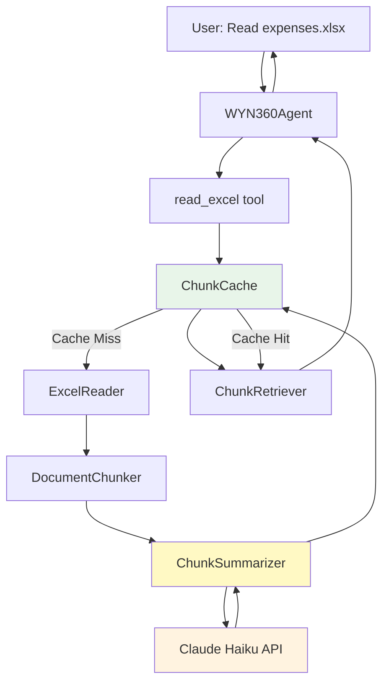

# WYN360 CLI - Document Readers Roadmap

**Status:** 🚧 Phase 3 Complete - Ready for Phase 4
**Start Date:** January 2025
**Target Completion:** February 2025

---

## 📋 Overview

This roadmap outlines the implementation of intelligent document readers for Excel, Word, and PDF files. Unlike simple file reading, these tools implement a **chunking + summarization + tagging + retrieval** system that allows WYN360 to handle arbitrarily large documents while maintaining intelligent query capabilities.

### Key Innovations

- 🧩 **Intelligent Chunking**: Documents split into manageable chunks (~1000 tokens)
- 📝 **Auto-Summarization**: Each chunk summarized to ~100 tokens using Claude Haiku
- 🏷️ **Tag Generation**: 5-8 keywords per chunk for efficient retrieval
- 🔍 **Query-Based Retrieval**: Match user questions against tags to find relevant sections
- 💾 **Smart Caching**: Cache summaries and tags for instant re-access (TTL: 1 hour)
- 🎯 **No Breaking Changes**: Add-on tools that integrate seamlessly with existing framework

### Design Philosophy

Following the `fetch_website` pattern:
- Optional dependencies with graceful fallback
- Token-aware processing with configurable limits
- Markdown output format for LLM consumption
- Full integration with slash commands and token tracking
- User-configurable behavior via config.yaml

---

## 🎯 Problem Statement

### Current Limitations

**Existing `read_file` tool:**
- ✅ Works for plain text files (.txt, .py, .json)
- ❌ Cannot handle structured documents (Excel, Word, PDF)
- ❌ No support for tables, charts, formulas, images
- ❌ Limited by file size (100KB limit)
- ❌ No intelligent truncation for large files

### Real-World Scenarios

**Scenario 1: Unstructured Excel Files**
- User has expense tracking spreadsheet with multiple sheets
- Tables don't start at A1 (notes, calculations scattered around)
- Each sheet has different purpose and structure
- User wants: "Summarize my Q2 expenses" or "What were April gas costs?"

**Scenario 2: Research Papers (Word)**
- 15-page research paper with sections, tables, equations, citations
- User wants: "Summarize the methodology" or "What are the conclusions?"
- Need to preserve document structure (headings, sections)
- Tables and formulas must be extracted accurately

**Scenario 3: Large PDFs**
- 120-page textbook or technical manual
- User wants: "Explain dropout from Chapter 2" or "Summarize conclusions"
- Cannot load entire document into context (would be 50K+ tokens)
- Need intelligent retrieval of relevant sections

---

## 🧠 Smart Truncation Algorithm

### The Problem

Traditional truncation (head/tail) doesn't work for documents:
- User asks: "What's in Chapter 5?" → If we only keep first/last pages, Chapter 5 is lost
- Excel with 20 sheets → Simple truncation would lose most sheets

### The Solution: Chunking + Summarization + Retrieval

```
Document (10,000 tokens)
    ↓
Split into chunks (1,000 tokens each) = 10 chunks
    ↓
For each chunk:
    - Summarize using Claude Haiku → 100 tokens
    - Generate tags (keywords) → 20 tokens
    - Store in cache
    ↓
Total cached: 10 × (100 + 20) = 1,200 tokens
    ↓
User asks question: "What were April expenses?"
    ↓
Match question against tags → Find chunks with "April" tag
    ↓
Retrieve relevant chunk summaries
    ↓
Return: Summary + original chunk if needed
```

### Example

**Excel File: expenses.xlsx (8,450 tokens)**

```
Sheet: Q1_Expenses (2,100 tokens)
→ Chunk 1 (rows 1-30): Summary: "January expenses $2,100..."
                       Tags: [expenses, January, Q1, food, gas]
→ Chunk 2 (rows 31-60): Summary: "February expenses $1,800..."
                        Tags: [expenses, February, Q1, utilities]
→ Chunk 3 (rows 61-90): Summary: "March expenses $1,340..."
                        Tags: [expenses, March, Q1, entertainment]

Sheet: Q2_Expenses (3,200 tokens)
→ Chunk 4 (rows 1-35): Summary: "April expenses $2,400..."
                       Tags: [expenses, April, Q2, gas, spike]
→ ...

User Query: "What were April expenses?"
→ Tag matching: "April" → Chunk 4
→ Return: "April expenses totaled $2,400, with gas showing a spike..."
```

---

## 🏗️ Architecture

### Module Structure

```
wyn360_cli/
├── document_readers.py          # NEW MODULE
│   ├── DocumentChunker          # Chunk documents intelligently
│   ├── ChunkSummarizer          # Summarize chunks using Claude
│   ├── ChunkCache               # Cache management
│   ├── ChunkRetriever           # Query matching & retrieval
│   ├── ExcelReader              # Excel-specific reader
│   ├── WordReader               # Word-specific reader
│   └── PDFReader                # PDF-specific reader
├── agent.py                     # Register new tools
├── cli.py                       # Add new slash commands
└── config.yaml                  # Add document_reader config
```

### Cache Structure

```
~/.wyn360/cache/documents/
├── {file_hash_1}/
│   ├── metadata.json           # File info, chunk count, timestamps
│   ├── chunks_index.json       # Chunk summaries, tags, positions
│   ├── chunk_001.txt           # Original chunk content (optional)
│   └── ...
├── {file_hash_2}/
│   └── ...
```

### Data Flow



---

## 📊 Implementation Phases

### Phase 1: Core Infrastructure (v0.3.26)

**Goal:** Build the foundation for all document readers

#### Tasks:
- [x] Create `document_readers.py` module ✅ COMPLETED
- [x] Implement `DocumentChunker` class ✅ COMPLETED
  - [x] `chunk_by_tokens()` - Split text by token count ✅
  - [x] `chunk_by_structure()` - Split by headings/sections ✅
  - [x] `smart_chunk_excel()` - Split by sheets + row ranges ✅
  - [x] Token counting utilities ✅
- [x] Implement `ChunkSummarizer` class ✅ COMPLETED
  - [x] `summarize_chunk()` - Call Claude Haiku for summarization ✅
  - [x] `generate_tags()` - Extract keywords from chunk ✅
  - [x] Prompt engineering for good summaries ✅
  - [x] Token tracking for summarization costs ✅
- [x] Implement `ChunkCache` class ✅ COMPLETED
  - [x] Cache directory management (`~/.wyn360/cache/documents/`) ✅
  - [x] `save_chunks()` - Write chunks_index.json ✅
  - [x] `load_chunks()` - Read cached chunks ✅
  - [x] `get_stats()` - Retrieve cache statistics ✅
  - [x] `clear_cache()` - Remove old/specific caches ✅
  - [x] TTL-based expiration (1 hour default) ✅
  - [x] MD5 file hashing for cache keys ✅
- [x] Implement `ChunkRetriever` class ✅ COMPLETED
  - [x] `match_query()` - Simple keyword matching ✅
  - [x] `get_relevant_chunks()` - Return top-K chunks ✅
  - [x] Score chunks by tag overlap ✅
- [x] Add new slash commands in `cli.py`: ✅ COMPLETED
  - [x] `/set_doc_tokens <excel|word|pdf> <tokens>` - Set token limits ✅
  - [x] `/clear_doc_cache [file_path]` - Clear cache ✅
  - [x] `/doc_cache_stats` - Show cache statistics ✅
  - [x] `/set_image_mode <skip|describe|vision>` - Image handling ✅
  - [x] `/set_pdf_engine <pymupdf|pdfplumber>` - PDF engine selection ✅
- [x] Update `/tokens` command to include document processing costs ✅ COMPLETED
- [x] Add configuration section to `config.yaml`: ✅ COMPLETED
  ```yaml
  document_reader:
    token_limits: {excel: 10000, word: 15000, pdf: 20000}
    chunking: {enabled: true, chunk_size: 1000, summary_size: 100}
    cache: {enabled: true, ttl: 3600, max_size_mb: 500}
  ```
- [x] Unit tests: ✅ ALL 74 TESTS PASSING
  - [x] `test_document_chunker.py` - Chunking logic (22 tests) ✅
  - [x] `test_chunk_summarizer.py` - Summarization (17 tests, mocked) ✅
  - [x] `test_chunk_cache.py` - Cache operations (19 tests) ✅
  - [x] `test_chunk_retriever.py` - Query matching (17 tests) ✅

**Success Criteria:**
- ✅ Chunking system works with text input
- ✅ Summarization calls Claude Haiku and returns ~100 token summaries
- ✅ Cache saves/loads correctly with TTL enforcement
- ✅ Retriever matches queries to relevant chunks
- ✅ All tests passing
- ✅ No breaking changes to existing tools

---

### Phase 2: Excel Reader (v0.3.27)

**Goal:** Enable intelligent reading of unstructured Excel files

#### Tasks:
- [x] Install optional dependency: `openpyxl` ✅ OPTIONAL (graceful fallback)
- [x] Implement `ExcelReader` class ✅ COMPLETED
  - [x] Open .xlsx/.xls files ✅
  - [x] List all sheets ✅
  - [x] Detect data regions per sheet (not assuming A1 start) ✅
  - [x] Handle merged cells ✅
  - [x] Show evaluated formula values (not formulas) ✅
  - [x] Convert to markdown tables ✅
- [x] Integrate with chunking system: ✅ COMPLETED
  - [x] Chunk by sheets first ✅
  - [x] If sheet too large, chunk by row ranges ✅
  - [x] Each chunk = one sheet or section of sheet ✅
- [x] Register `read_excel` tool in `agent.py`: ✅ COMPLETED
  ```python
  @agent.tool
  async def read_excel(
      file_path: str,
      max_tokens: int = 10000,
      include_sheets: Optional[List[str]] = None,
      use_chunking: bool = True,
      regenerate_cache: bool = False,
      query: Optional[str] = None
  ) -> str:
  ```
- [x] Output format: ✅ COMPLETED
  - [x] Document header (file, sheets, tokens, chunks) ✅
  - [x] Per-sheet summaries ✅
  - [x] Tags for each chunk ✅
  - [x] Query retrieval support ✅
- [x] Error handling: ✅ COMPLETED
  - [x] File not found ✅
  - [x] openpyxl not installed → clear error message ✅
  - [x] Corrupted Excel files ✅
- [ ] Update documentation:
  - [ ] README.md - Add Excel reading example
  - [ ] USE_CASES.md - Add Excel use cases
  - [ ] SYSTEM.md - Document Excel reader architecture
- [x] Unit tests: ✅ ALL 14 TESTS PASSING
  - [x] `test_excel_reader.py` - Excel reading logic ✅
  - [x] Test multi-sheet files ✅
  - [x] Test unstructured data (tables not at A1) ✅
  - [x] Test caching and retrieval ✅
  - [x] Test with/without openpyxl ✅

**Success Criteria:**
- ✅ Can read multi-sheet Excel files
- ✅ Detects data regions regardless of position
- ✅ Shows evaluated formulas (what user sees)
- ✅ Chunking works correctly for large spreadsheets
- ✅ Cache hit/miss works properly
- ✅ Query retrieval finds relevant sheets
- ✅ All tests passing

**Example Usage:**
```
You: Read expenses.xlsx

WYN360:
📊 Excel File: expenses.xlsx
Sheets: 3 | Chunks: 9 | Cache: ✓ Generated

Summary:
- Q1_Expenses: $5,240 total, Jan highest
- Q2_Expenses: $6,180 total, Apr peak
- Summary: YTD $11,420, +8% over budget

You: What were the April expenses?

WYN360: [Retrieves Chunk 5]
April expenses totaled $2,400 with breakdown:
- Food: $680
- Gas: $590 (15% increase from March)
- Utilities: $520
- Entertainment: $320
- Misc: $290
```

---

### Phase 3: Word Reader (v0.3.28)

**Goal:** Enable reading of structured Word documents with tables, images, and sections

#### Tasks:
- [x] Install optional dependency: `python-docx` ✅ OPTIONAL (graceful fallback)
- [x] Implement `WordReader` class ✅ COMPLETED
  - [x] Open .docx files ✅
  - [x] Extract document structure: ✅
    - [x] Headings (H1, H2, H3) → `#`, `##`, `###` ✅
    - [x] Paragraphs → plain text ✅
    - [x] Tables → markdown tables ✅
    - [x] Lists → markdown lists ✅
  - [x] Handle images: ✅
    - [x] Default: "describe" mode (extract alt text/captions) ✅
    - [x] Optional: "skip" mode (ignore images) ✅
    - [x] Optional: "vision" mode (use Claude vision API) ✅
  - [x] Preserve document hierarchy ✅
- [x] Structure-aware chunking: ✅ COMPLETED
  - [x] Chunk by major sections (H1/H2 boundaries) ✅
  - [x] Keep tables within chunks (don't split) ✅
  - [x] Target ~1000 tokens per chunk ✅
  - [x] Preserve section context in chunk metadata ✅
- [x] Register `read_word` tool in `agent.py`: ✅ COMPLETED
  ```python
  @agent.tool
  async def read_word(
      file_path: str,
      max_tokens: int = 15000,
      use_chunking: bool = True,
      image_handling: str = "describe",
      regenerate_cache: bool = False,
      query: Optional[str] = None
  ) -> str:
  ```
- [x] Add `/set_image_mode <skip|describe|vision>` slash command ✅ ALREADY IN PHASE 1
- [x] Image handling implementation: ✅ COMPLETED
  - [x] "skip": Ignore images entirely ✅
  - [x] "describe": Extract alt text, captions, nearby text ✅
  - [x] "vision": Call Claude vision API (warn about costs) ✅
- [x] Output format: ✅ COMPLETED
  - [x] Document header (pages, sections, tokens) ✅
  - [x] Section-by-section summaries ✅
  - [x] Tables preserved in markdown ✅
  - [x] Image handling indicators ✅
- [x] Error handling: ✅ COMPLETED
  - [x] File not found ✅
  - [x] python-docx not installed ✅
  - [x] Corrupted Word files ✅
  - [x] Vision API failures ✅
- [ ] Update documentation
- [x] Unit tests: ✅ ALL 14 TESTS PASSING
  - [x] `test_word_reader.py` ✅
  - [x] Test structured documents ✅
  - [x] Test table extraction ✅
  - [x] Test image handling modes ✅
  - [x] Test chunking by sections ✅

**Success Criteria:**
- ✅ Preserves document structure in markdown
- ✅ Tables converted accurately
- ✅ Image handling modes work correctly
- ✅ Structure-aware chunking keeps sections together
- ✅ Query retrieval finds relevant sections
- ✅ All tests passing

---

### Phase 4: PDF Reader (v0.3.29)

**Goal:** Enable reading of PDFs with page-aware chunking and table detection

#### Tasks:
- [ ] Install optional dependencies:
  - [ ] `pymupdf` (PyMuPDF) - default, fast, general-purpose
  - [ ] `pdfplumber` - optional, better for complex tables
- [ ] Implement `PDFReader` class
  - [ ] Open .pdf files
  - [ ] Extract text page by page
  - [ ] Detect tables (preserve structure)
  - [ ] Handle multi-column layouts
  - [ ] Detect sections via font sizes/styles
  - [ ] Extract table of contents if available
- [ ] Page-aware chunking:
  - [ ] Chunk by page ranges (3-5 pages per chunk)
  - [ ] Preserve page boundaries
  - [ ] Don't split tables across chunks
  - [ ] Target ~1000 tokens per chunk
- [ ] Register `read_pdf` tool in `agent.py`:
  ```python
  @agent.tool
  async def read_pdf(
      file_path: str,
      max_tokens: int = 20000,
      page_range: Optional[Tuple[int, int]] = None,
      use_chunking: bool = True,
      pdf_engine: str = "pymupdf",
      regenerate_cache: bool = False,
      query: Optional[str] = None
  ) -> str:
  ```
- [ ] Add `/set_pdf_engine <pymupdf|pdfplumber>` slash command
- [ ] PDF engine switching:
  - [ ] Default: pymupdf (fast, general)
  - [ ] Optional: pdfplumber (complex tables)
  - [ ] Auto-detect table complexity?
- [ ] Page range support:
  - [ ] `page_range=(10, 25)` → Extract only pages 10-25
  - [ ] Useful for large documents
- [ ] Output format:
  - [ ] Document header (pages, tokens, chunks)
  - [ ] Table of contents summary
  - [ ] Page-by-page or section-by-section summaries
  - [ ] Clear page markers
- [ ] Error handling:
  - [ ] File not found
  - [ ] Libraries not installed
  - [ ] Corrupted/password-protected PDFs
  - [ ] Scanned PDFs (no text layer)
- [ ] Update documentation
- [ ] Unit tests:
  - [ ] `test_pdf_reader.py`
  - [ ] Test multi-page PDFs
  - [ ] Test table extraction
  - [ ] Test page range support
  - [ ] Test both PDF engines

**Success Criteria:**
- ✅ Handles large PDFs (100+ pages)
- ✅ Tables extracted accurately
- ✅ Page-aware chunking works correctly
- ✅ Page range filtering works
- ✅ Both PDF engines supported
- ✅ Query retrieval finds relevant pages
- ✅ All tests passing

---

### Phase 5: Enhancements (v0.3.30+)

**Goal:** Advanced features and optimizations

#### Future Enhancements:
- [ ] **Vision Mode for Images (High Priority)**
  - [ ] Integrate Claude vision API for Word/PDF images
  - [ ] Extract meaningful descriptions from charts, diagrams
  - [ ] Cost warnings for users
  - [ ] Batch image processing for efficiency

- [ ] **Semantic Matching (High Priority)**
  - [ ] Replace keyword matching with embeddings
  - [ ] Use sentence transformers or similar
  - [ ] Compute embeddings for chunk tags
  - [ ] Cosine similarity for query matching
  - [ ] Significantly better retrieval accuracy

- [ ] **OCR Support for Scanned PDFs (Medium Priority)**
  - [ ] Integrate Tesseract OCR
  - [ ] Detect scanned vs text-based PDFs
  - [ ] Extract text from images in PDFs
  - [ ] Warning about OCR accuracy

- [ ] **Excel Enhancements (Medium Priority)**
  - [ ] Chart/graph descriptions
  - [ ] Pivot table support
  - [ ] Formula dependency analysis
  - [ ] Cross-sheet reference tracking

- [ ] **Multi-Document Queries (Low Priority)**
  - [ ] Query across multiple cached documents
  - [ ] "Compare expenses.xlsx and budget.xlsx"
  - [ ] Cross-reference information
  - [ ] Unified search across document cache

- [ ] **Performance Optimizations (Ongoing)**
  - [ ] Parallel chunk summarization
  - [ ] Streaming for large files
  - [ ] Incremental caching (only process new/changed chunks)
  - [ ] Background cache warming

- [ ] **Advanced Chunking Strategies (Low Priority)**
  - [ ] Adaptive chunk sizes based on content density
  - [ ] Overlap between chunks for context
  - [ ] Hierarchical chunking (sections → paragraphs)

---

## 🔧 Technical Specifications

### Token Limits (Configurable)

| Document Type | Default Max Tokens | Rationale |
|---------------|-------------------|-----------|
| Excel | 10,000 | Dense tables, multiple sheets |
| Word | 15,000 | Typical document length |
| PDF | 20,000 | Longer documents, books |

### Chunking Parameters

| Parameter | Default | Range | Description |
|-----------|---------|-------|-------------|
| `chunk_size` | 1,000 | 500-2,000 | Tokens per chunk |
| `summary_size` | 100 | 50-200 | Target summary length |
| `tag_count` | 8 | 5-15 | Keywords per chunk |
| `top_k_chunks` | 3 | 1-10 | Chunks to retrieve per query |

### Cache Settings

| Parameter | Default | Description |
|-----------|---------|-------------|
| `ttl` | 3,600 sec (1 hour) | Time to live for cached chunks |
| `max_size_mb` | 500 MB | Maximum cache directory size |
| `cleanup_threshold` | 0.9 (90%) | Trigger cleanup at 90% full |

### Summarization Costs

**Using Claude Haiku for summaries:**
- Input: ~1,000 tokens per chunk
- Output: ~120 tokens (100 summary + 20 tags)
- Cost per chunk: ~$0.0003 (input) + ~$0.0002 (output) = **$0.0005**
- Example: 100-page PDF (100 chunks) = **$0.05**

**Comparison to reading full document:**
- Full 100-page PDF: ~50,000 tokens
- Single Claude Sonnet call: ~$0.15 input
- With chunking: $0.05 summarization + multiple smaller queries = **more cost-efficient for repeated access**

---

## 🧪 Testing Strategy

### Unit Tests

Each phase includes comprehensive unit tests:

**Phase 1 (Core Infrastructure):**
- `test_document_chunker.py` - Chunking algorithms
- `test_chunk_summarizer.py` - Summarization (mocked Claude API)
- `test_chunk_cache.py` - Cache operations, TTL, cleanup
- `test_chunk_retriever.py` - Query matching, scoring

**Phase 2 (Excel):**
- `test_excel_reader.py` - Excel reading, multi-sheet, data detection
- Test files: structured.xlsx, unstructured.xlsx, formulas.xlsx

**Phase 3 (Word):**
- `test_word_reader.py` - Structure extraction, tables, images
- Test files: simple.docx, complex.docx, with_tables.docx

**Phase 4 (PDF):**
- `test_pdf_reader.py` - Page extraction, tables, both engines
- Test files: text.pdf, tables.pdf, scanned.pdf

### Integration Tests

- Test full workflow: read → chunk → summarize → cache → query → retrieve
- Test with real files (not just mocked)
- Test cache hit/miss scenarios
- Test token tracking integration
- Test slash command functionality

### Performance Tests

- Large file handling (100+ pages)
- Cache performance (10,000+ chunks)
- Summarization speed (parallel vs sequential)
- Memory usage for large documents

---

## 📚 Documentation Plan

### README.md Updates

Add section: **📄 Document Reading**
```markdown
### Reading Excel, Word, and PDF Files

WYN360 can intelligently read and analyze structured documents:

You: Read expenses.xlsx
You: Summarize research_paper.docx
You: What's in Chapter 5 of textbook.pdf?
```

### USE_CASES.md

Add new use cases:
- **Use Case 15: Expense Report Analysis** (Excel)
- **Use Case 16: Research Paper Summarization** (Word)
- **Use Case 17: Textbook Navigation** (PDF)

### SYSTEM.md

Add architecture section:
- **Document Readers Layer**
  - Chunking architecture diagram
  - Summarization flow
  - Cache structure
  - Tool descriptions

### New Documentation

- **DOCUMENT_READERS.md** - Detailed user guide
  - Supported formats
  - Configuration options
  - Slash commands
  - Best practices
  - Troubleshooting

---

## ✅ Success Metrics

### Technical Metrics

- **Test Coverage:** >90% for all document reader modules
- **Performance:**
  - Excel (10 sheets): <10 seconds
  - Word (50 pages): <15 seconds
  - PDF (100 pages): <30 seconds
- **Cache Hit Rate:** >90% for repeated reads within TTL
- **Memory Usage:** <500MB for largest supported document
- **Token Efficiency:** Chunked reading uses <20% tokens of full read

### User Experience Metrics

- **Query Accuracy:** Top-3 chunks relevant in >80% of queries
- **Summary Quality:** User validation (captures key information)
- **Error Handling:** Clear error messages for all failure modes
- **No Breaking Changes:** All existing tools work unchanged

### Adoption Metrics (Post-Release)

- Usage of document tools vs traditional read_file
- Cache hit rates in production
- User feedback on summary quality
- Feature requests and bug reports

---

## 🔄 Maintenance & Updates

### Ongoing Maintenance

- Monitor cache disk usage
- Update dependencies (openpyxl, python-docx, pymupdf)
- Improve summarization prompts based on feedback
- Add support for new file formats (e.g., .odt, .pages)

### Version History

| Version | Phase | Status | Features | Release Date |
|---------|-------|--------|----------|--------------|
| v0.3.26 | Phase 1 | 🚧 In Progress | Core infrastructure | TBD |
| v0.3.27 | Phase 2 | ⏳ Planned | Excel reader | TBD |
| v0.3.28 | Phase 3 | ⏳ Planned | Word reader | TBD |
| v0.3.29 | Phase 4 | ⏳ Planned | PDF reader | TBD |
| v0.3.30+ | Phase 5 | 💡 Future | Enhancements | TBD |

---

## 🤝 Related Roadmaps

- **[ROADMAP.md](ROADMAP.md)** - Main feature roadmap
- **[ROADMAP_BROWSERUSE.md](ROADMAP_BROWSERUSE.md)** - Browser use / website fetching

---

## 📞 Feedback & Support

- **GitHub Issues:** https://github.com/yiqiao-yin/wyn360-cli/issues
- **Feature Requests:** Tag with `enhancement` and `document-readers`
- **Bug Reports:** Tag with `bug` and `document-readers`

---

**Last Updated:** January 12, 2025
**Maintained by:** Yiqiao Yin (yiqiao.yin@wyn-associates.com)
