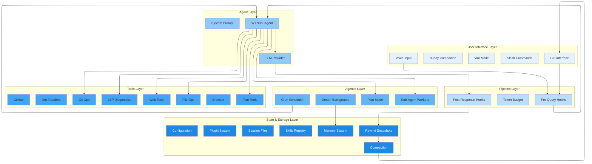
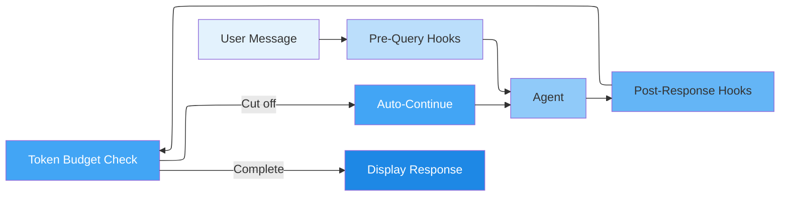
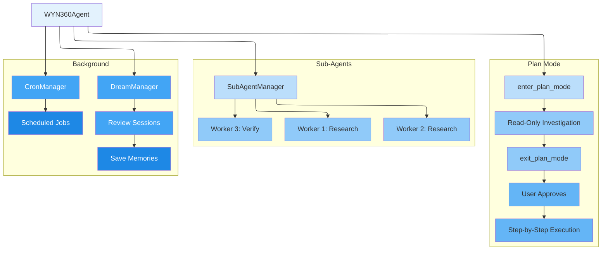
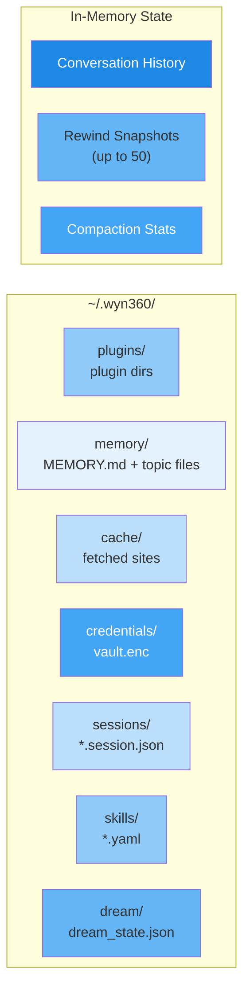

# WYN360 CLI - System Architecture

This document provides a detailed overview of the WYN360 CLI system architecture, including all components, layers, and data flows.

**Version:** 0.5.2
**Last Updated:** April 2026

---

## Architecture Overview

WYN360 CLI is built on a modular, layered architecture with six main layers. The v0.4.0 and v0.5.0 releases added three new architectural layers (Pipeline, Agentic, State Management) on top of the original three (UI, Agent, Tools).



---

## Layer Descriptions

### 1. User Interface Layer

The entry point for all user interaction.

| Component | Module | Purpose |
|-----------|--------|---------|
| **CLI Interface** | `cli.py` | Click-based CLI with prompt_toolkit input, Rich console output |
| **Slash Commands** | `cli.py` | 25+ commands: `/plan`, `/memory`, `/dream`, `/rewind`, `/cron`, `/plugins`, etc. |
| **Vim Mode** | `vim_mode.py` | Vi-style editing via prompt_toolkit (toggle with `/vim`) |
| **Voice Input** | `voice.py` | Speech-to-text via SpeechRecognition (toggle with `/voice`) |
| **Buddy** | `buddy.py` | Virtual companion with deterministic generation and event reactions |

**Input flow:**
```
User types message (or speaks via /voice)
  → Slash command? → handle_slash_command() → display result
  → Normal message? → pass to Pipeline Layer
```

### 2. Pipeline Layer (new in v0.4.0)

Middleware that processes every message before and after the AI sees it. Runs automatically on every turn.



| Component | Module | Trigger | Purpose |
|-----------|--------|---------|---------|
| **Pre-Query Hooks** | `hooks.py` | Every message | Validate input, transform messages, safety warnings |
| **Post-Response Hooks** | `hooks.py` | Every response | Filter output, log, modify responses |
| **Token Budget** | `token_budget.py` | Every response | Auto-continue if response was cut off by max_tokens |

**Built-in hooks (always active):**
- `builtin_safety_check` — warns on `rm -rf`, `DROP TABLE`, etc.
- `builtin_response_tracker` — logs oversized responses

### 3. Agent Layer

The core orchestrator that routes between the LLM and tools.

| Component | Module | Purpose |
|-----------|--------|---------|
| **WYN360Agent** | `agent.py` | Main agent class using pydantic-ai framework |
| **LLM Provider** | `agent.py` | Routes to Anthropic, AWS Bedrock, Google Gemini, or OpenAI |
| **System Prompt** | `agent.py` | Dynamic prompt including memory context, plan state, skills list |
| **Conversation History** | `agent.py` | Maintains context across turns with pydantic-ai message objects |

**Provider selection:** `CHOOSE_CLIENT` env var (1=Anthropic, 2=Bedrock, 3=Gemini, 4=OpenAI) or auto-detect from API keys.

### 4. Agentic Layer (new in v0.4.0/v0.5.0)

Autonomous subsystems that operate independently or in parallel.



| Component | Module | Trigger | Purpose |
|-----------|--------|---------|---------|
| **Plan Mode** | `planner.py` | AI calls `enter_plan_mode` tool | Structured planning before code changes |
| **Sub-Agents** | `subagent.py` | AI spawns workers | Parallel research, implementation, verification |
| **Dream** | `dream.py` | Auto after 24h + 3 sessions | Background memory consolidation from session transcripts |
| **Cron** | `cron_agent.py` | User creates with `/cron add` | Recurring scheduled tasks (e.g., monitor CI every 5m) |

### 5. Tools Layer

Functions the AI can call to interact with the filesystem, web, and external services.

| Category | Tools | Module |
|----------|-------|--------|
| **File Operations** | `read_file`, `write_file`, `list_files`, `delete_file`, `move_file`, `create_directory` | `agent.py`, `utils.py` |
| **Git Operations** | `git_status`, `git_diff`, `git_log`, `git_branch` | `agent.py` |
| **Code Operations** | `execute_command`, `search_files`, `generate_tests` | `agent.py`, `utils.py` |
| **GitHub** | `gh_commit_changes`, `gh_create_pr`, `gh_create_branch`, `gh_checkout_branch`, `gh_merge_branch` | `agent.py` |
| **Web** | `web_search` (builtin), `fetch_website`, `browse_and_find` | `agent.py`, `browser_use.py` |
| **Browser** | `analyze_page_dom`, `execute_dom_action`, `intelligent_browse`, `login_to_website` | `agent.py`, `tools/browser/` |
| **Documents** | `read_excel`, `read_word`, `read_pdf` | `agent.py`, `document_readers.py` |
| **Plan Mode** | `enter_plan_mode`, `exit_plan_mode` | `agent.py`, `planner.py` |
| **HuggingFace** | `create_hf_space`, `push_to_hf_space`, `check_hf_authentication` | `agent.py` |

### 6. State & Storage Layer

Persistent state management across sessions.



| Component | Module | Storage | Purpose |
|-----------|--------|---------|---------|
| **Memory** | `memory.py` | `~/.wyn360/memory/` | Persistent cross-session knowledge (user, feedback, project, reference) |
| **Skills** | `skills.py` | `~/.wyn360/skills/` + `.wyn360/skills/` | User-defined slash commands via YAML |
| **Plugins** | `plugin_system.py` | `~/.wyn360/plugins/` | Installable extensions with YAML manifests |
| **Rewind** | `rewind.py` | In-memory | Conversation state snapshots for undo (up to 50) |
| **Compaction** | `compaction.py` | In-memory | Auto-drops old messages when history exceeds 50 |
| **Configuration** | `config.py` | `~/.wyn360/config.yaml` + `.wyn360.yaml` | Three-tier config (user < project < env vars) |
| **Sessions** | `session_manager.py` | `~/.wyn360/sessions/` | Cookie storage for authenticated browsing |
| **Credentials** | `credential_manager.py` | `~/.wyn360/credentials/vault.enc` | AES-256-GCM encrypted token storage |
| **Dream State** | `dream.py` | `~/.wyn360/dream/` | Tracks last consolidation time, lock file |
| **LSP** | `lsp_client.py` | In-memory | Cached diagnostics from pyright/ruff |

---

## Data Flow

### Complete Request/Response Cycle

```
User types message
  │
  ├─ Slash command (/plan, /memory, /dream, etc.)
  │   → handle_slash_command() → display result → done
  │
  └─ Normal message
      → Pre-Query Hooks fire (safety check, custom hooks)
      → Token Budget starts tracking
      → Agent sends to LLM with conversation history + memory context
      → LLM may call tools:
      │   ├─ enter_plan_mode → switch to read-only investigation
      │   ├─ read_file, search_files → return results
      │   ├─ write_file, execute_command → modify filesystem
      │   └─ exit_plan_mode → create plan for user approval
      → LLM returns response
      → Post-Response Hooks fire (tracking, custom hooks)
      → Token Budget checks: cut off? → auto-continue if needed
      → Rewind takes snapshot of conversation state
      → Compaction checks: >50 messages? → drop oldest, keep 10
      → Dream checks: 24h+ and 3+ sessions? → background consolidation
      → Display response to user
```

### Plan Mode Flow

```
User: "Add authentication to the app"
  → AI decides task is complex
  → AI calls enter_plan_mode("Add authentication")
  → AI investigates: read_file, search_files, list_files (NO writes)
  → AI calls exit_plan_mode("1. Create middleware\n2. Add JWT\n3. Update routes\n4. Write tests")
  → Plan displayed to user

User: /plan approve
  → Plan steps execute sequentially
  → User: /plan status → "2/4 steps completed"
  → User: /plan skip → skip current step
```

### Dream Consolidation Flow

```
After every AI response (automatic):
  → Check: 24+ hours since last dream? AND 3+ new sessions?
  → Yes → Acquire filesystem lock
       → Background task: read recent session transcripts
       → AI agent extracts useful patterns
       → Save as memory files in ~/.wyn360/memory/
       → Release lock, update dream_state.json
  → No → Skip silently
```

---

## Module Map

```
wyn360_cli/
├── cli.py                  # CLI entry, slash commands, chat loop
├── agent.py                # WYN360Agent, tool definitions, LLM routing
├── config.py               # Three-tier configuration system
├── utils.py                # File ops, command execution, metrics
│
├── # Agentic Features (v0.4.0)
├── memory.py               # Persistent memory with YAML frontmatter
├── subagent.py             # Parallel worker agents
├── planner.py              # Plan mode state machine
├── token_budget.py         # Auto-continue on max_tokens
├── skills.py               # User-defined slash commands
├── hooks.py                # Pre/post response pipeline
│
├── # Advanced Features (v0.5.0)
├── dream.py                # Background memory consolidation
├── compaction.py            # Auto-summarize old messages
├── vim_mode.py             # Vi-style editing
├── voice.py                # Speech-to-text input
├── buddy.py                # Virtual companion
├── cron_agent.py           # Scheduled recurring agents
├── plugin_system.py        # Plugin management
├── lsp_client.py           # Language server diagnostics
├── rewind.py               # Conversation state snapshots
│
├── # Infrastructure
├── browser_use.py          # Website fetching with crawl4ai
├── browser_auth.py         # Playwright-based login automation
├── browser_controller.py   # Browser automation
├── credential_manager.py   # AES-256 encrypted credential storage
├── session_manager.py      # Cookie/session management
├── vision_engine.py        # Claude Vision API
├── document_readers.py     # Excel/Word/PDF processing
│
├── tools/
│   └── browser/            # DOM-first browser automation subsystem
│       ├── automation_orchestrator.py
│       ├── browser_tools.py
│       └── ...
│
└── tests/
    ├── test_agent.py       # 93 tests
    ├── test_cli.py         # 33 tests
    ├── test_config.py      # 25 tests
    ├── test_utils.py       # 29 tests
    ├── test_memory.py      # 14 tests
    ├── test_subagent.py    # 14 tests
    ├── test_planner.py     # 26 tests
    ├── test_token_budget.py # 12 tests
    ├── test_skills.py      # 13 tests
    ├── test_hooks.py       # 20 tests
    ├── test_dream.py       # 11 tests
    └── test_v050_features.py # 62 tests
```

---

## Feature Timeline

| Version | Features Added |
|---------|---------------|
| v0.1.0-v0.2.x | Core CLI, file ops, code generation |
| v0.3.0-v0.3.20 | Model switching, config system, streaming, session save/load |
| v0.3.21-v0.3.25 | Web search, browser use, website fetching, caching |
| v0.3.40-v0.3.41 | Authenticated browsing, credential encryption, session cookies |
| v0.3.60-v0.3.80 | DOM browser automation, document readers, multi-provider support |
| **v0.4.0** | **Memory, sub-agents, planner, token budget, skills, hooks** |
| **v0.5.0** | **Dream, compaction, vim, voice, buddy, cron, plugins, LSP, rewind** |
| **v0.5.1** | **Plan mode AI tools (enter/exit_plan_mode)** |
| **v0.5.2** | **Dream auto-trigger wired into chat loop** |

---

## Design Principles

1. **Safety First** — Confirmation prompts, hook-based safety warnings, overwrite protection
2. **Automatic by Default** — Hooks, compaction, dream, token budget all fire without user action
3. **User Control** — 25+ slash commands for manual override when needed
4. **Transparent** — Token tracking, cost visibility, `/hooks` and `/budget` status commands
5. **Extensible** — Skills (YAML), plugins (Python), hooks (programmatic) for customization
6. **Context Aware** — Memory persistence, plan state, conversation history across turns

---

**Maintained by:** Yiqiao Yin (yiqiao.yin@wyn-associates.com)
