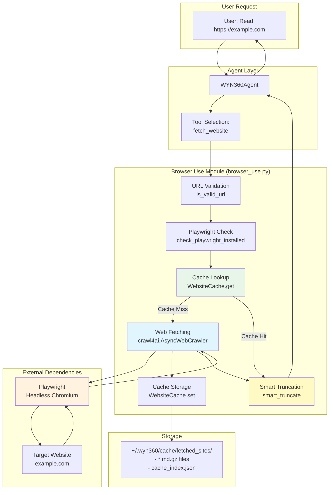

# WYN360 CLI - System Architecture

This document provides a detailed overview of the WYN360 CLI system architecture, including all components, layers, and data flows.

**Version:** 0.3.41
**Last Updated:** November 2025

---

## 🏗️ Architecture Overview

WYN360 CLI is built on a modular, layered architecture that separates concerns and enables flexible extensibility.

Executive version:

```mermaid
---
config:
  layout: elk
  elk:
    algorithm: layered
    direction: DOWN
---
graph TB
    subgraph "User Interface Layer"
        CLI[🖥️ CLI Interface]
        Input[📝 User Input]
        Output[📺 Console Output]
    end

    subgraph "Multi-Provider AI Core"
        Agent[🤖 WYN360Agent]
        Claude[🧠 Anthropic Claude]
        Gemini[⭐ Google Gemini]
        Bedrock[☁️ AWS Bedrock]
        OpenAI[🚀 OpenAI]
        Tools[🔧 Tool System]
    end

    subgraph "Essential Tools"
        Files[📁 File Operations<br/>read, write, list, search]
        Commands[⚡ Shell Commands<br/>execute with confirmation]
        Git[📊 Git Operations<br/>status, diff, commit, branch]
        Web[🌐 Web Tools<br/>search, fetch, browse]
    end

    subgraph "Advanced Integrations"
        GitHub[🐙 GitHub Integration<br/>auth, PR, branches, commits]
        HF[🤗 HuggingFace<br/>spaces, deployment]
        Browser[🔍 Browser Automation<br/>DOM-first + Stagehand + Vision]
        Docs[📄 Document Processing<br/>Excel, Word, PDF + Vision]
    end

    Input --> CLI
    CLI --> Agent
    Agent --> Claude
    Agent --> Gemini
    Agent --> Bedrock
    Agent --> OpenAI
    Agent --> Tools
    Tools --> Files
    Tools --> Commands
    Tools --> Git
    Tools --> Web
    Tools --> GitHub
    Tools --> HF
    Tools --> Browser
    Tools --> Docs
    Claude --> Output
    Gemini --> Output
    Bedrock --> Output
    OpenAI --> Output
    CLI --> Output

    style Agent fill:#e1f5ff,stroke:#0066cc,stroke-width:3px
    style Claude fill:#ff6b35,color:#fff
    style Gemini fill:#4285f4,color:#fff
    style Bedrock fill:#ff9900,color:#fff
    style OpenAI fill:#00a67e,color:#fff
    style CLI fill:#f3e5f5,stroke:#9c27b0,stroke-width:2px
```



Here's a detailed version:

```mermaid
---
config:
  layout: elk
  elk:
    algorithm: layered
    direction: DOWN
    spacing:
      nodeDistance: 100
      layerDistance: 150
    nodePlacement: NETWORK_SIMPLEX
    edgeRouting: ORTHOGONAL
---
graph TD
    %% Input Layer
    A[👤 User Input<br/>Multi-line, Shift+Enter] --> B[🖥️ CLI Interface<br/>click + prompt-toolkit]
    B --> C{⚡ Command Router<br/>Slash commands<br/>Tool selection}

    %% Configuration Layer
    D[👤 User Config<br/>~/.wyn360/config.yaml] --> E[⚙️ Config Merger]
    F[📁 Project Config<br/>.wyn360.yaml] --> E
    G[🌍 Environment Variables<br/>API keys, overrides] --> E
    E --> H[🤖 WYN360Agent<br/>pydantic-ai framework]

    %% Command Handlers Layer
    C -->|💬 Chat| H
    C -->|📁 Files| I[File Operations<br/>read/write/search]
    C -->|🔧 Git| J[Git Operations<br/>status/diff/commit]
    C -->|🌐 Web| K[Web Operations<br/>search/fetch/browse]
    C -->|📄 Docs| L[Document Processing<br/>Excel/Word/PDF]

    %% AI Provider Layer
    H --> M[🤖 AI Provider Router<br/>Dynamic model selection]
    M --> N[🧠 Anthropic Claude<br/>claude-sonnet-4<br/>200K context, $3/$15 per M]
    M --> O[⭐ Google Gemini<br/>gemini-2.5-flash<br/>2M context, $0.075/$0.30 per M]
    M --> P[☁️ AWS Bedrock<br/>Enterprise Claude<br/>AWS compliance]
    M --> Q[🚀 OpenAI<br/>gpt-4o<br/>Function calling, $2.50/$10 per M]

    %% Core Tools Layer
    I --> R[📖 read_file<br/>Size limits, encoding]
    I --> S[✏️ write_file<br/>Overwrite protection]
    I --> T[📂 list_files<br/>Directory scanning]
    I --> U[🔍 search_files<br/>Regex patterns]

    J --> V[📊 git_status<br/>Working tree]
    J --> W[📋 git_diff<br/>File changes]
    J --> X[📜 git_log<br/>History]
    J --> Y[🌿 git_branch<br/>Branch ops]

    %% Advanced Features Layer
    K --> Z[🌐 Web Search<br/>Real-time, $0.01/search]
    K --> AA[📡 Website Fetching<br/>crawl4ai + caching]
    K --> AB[🎭 Browser Automation<br/>DOM → Stagehand → Vision]

    L --> AC[📊 Excel Processing<br/>openpyxl + semantic]
    L --> AD[📝 Word Processing<br/>python-docx + chunks]
    L --> AE[📄 PDF Processing<br/>PyMuPDF + embeddings]
    L --> AF[👀 Vision Mode<br/>Charts, OCR]

    %% Authentication & Sessions Layer
    AB --> AG[🔐 Browser Auth<br/>Form detection]
    AB --> AH[🗝️ Credential Manager<br/>AES-256-GCM encryption]
    AB --> AI[🍪 Session Manager<br/>30min TTL cookies]
    AA --> AI

    %% GitHub Integration Layer
    H --> AJ[🐙 GitHub Integration<br/>CLI authentication]
    AJ --> AK[📤 gh_commit_changes<br/>Stage, commit, push]
    AJ --> AL[🔀 gh_create_pr<br/>Pull requests]
    AJ --> AM[🌿 gh_branch_ops<br/>Create, checkout, merge]

    %% Utility Layer
    H --> AN[⚡ Command Executor<br/>Timeout, confirmation]
    H --> AO[📊 History Manager<br/>Context persistence]
    H --> AP[💰 Token Tracker<br/>Usage, cost estimation]
    H --> AQ[💾 Session Manager<br/>Save/load JSON]

    %% Response Processing Layer
    N --> AR[🔄 Response Processor<br/>Stream handling]
    O --> AR
    P --> AR
    Q --> AR

    AR --> AS[📝 Content Formatter<br/>Markdown rendering]
    AS --> AT[📺 Rich Output<br/>Word-by-word streaming]

    %% Output Connections
    R --> AT
    S --> AT
    T --> AT
    U --> AT
    V --> AT
    W --> AT
    X --> AT
    Y --> AT
    Z --> AT
    AA --> AT
    AB --> AT
    AC --> AT
    AD --> AT
    AE --> AT
    AF --> AT
    AK --> AT
    AL --> AT
    AM --> AT
    AN --> AT
    AO --> AT
    AP --> AT
    AQ --> AT

    %% Styling by Layer
    classDef inputLayer fill:#e3f2fd,stroke:#1976d2,stroke-width:2px
    classDef configLayer fill:#f3e5f5,stroke:#7b1fa2,stroke-width:2px
    classDef aiLayer fill:#e8f5e8,stroke:#2e7d32,stroke-width:2px
    classDef toolLayer fill:#fff3e0,stroke:#ef6c00,stroke-width:2px
    classDef authLayer fill:#fce4ec,stroke:#c2185b,stroke-width:2px
    classDef outputLayer fill:#e1f5fe,stroke:#0277bd,stroke-width:2px
    classDef agentCore fill:#fff9c4,stroke:#f57f17,stroke-width:3px

    class A,B,C inputLayer
    class D,E,F,G configLayer
    class H agentCore
    class M,N,O,P,Q aiLayer
    class I,J,K,L,R,S,T,U,V,W,X,Y,Z,AA,AB,AC,AD,AE,AF,AJ,AK,AL,AM toolLayer
    class AG,AH,AI authLayer
    class AN,AO,AP,AQ,AR,AS,AT outputLayer
```



> **Diagram Interaction:** For better readability of large diagrams, right-click and select "Open image in new tab" or use your browser's zoom controls. The elk layout algorithm provides optimized positioning for complex system architectures.

> **Note:** While some documentation platforms support interactive zoom and pan for Mermaid diagrams (like [VitePress with mermaid renderer plugins](https://github.com/sametcn99/vitepress-mermaid-renderer) or [custom Docsify zoom plugins](https://github.com/corentinleberre/docsify-mermaid-zoom)), Docusaurus doesn't currently provide native fullscreen/zoom capabilities for Mermaid diagrams. The elk layout optimization above improves diagram structure and readability.

---

    subgraph "GitHub Integration Tools (Phase 8.1)"
        CheckGHAuth[check_gh_authentication<br/>Check GitHub auth status]
        AuthGH[authenticate_gh<br/>Authenticate with token]
        GHCommit[gh_commit_changes<br/>Commit and push changes]
        GHCreatePR[gh_create_pr<br/>Create pull request]
        GHCreateBranch[gh_create_branch<br/>Create new branch]
        GHCheckoutBranch[gh_checkout_branch<br/>Switch branch]
        GHMergeBranch[gh_merge_branch<br/>Merge branches]
    end

    subgraph "Authentication Tools (Phase 4)"
        LoginWebsite[login_to_website<br/>Automated browser login<br/>Form detection<br/>CAPTCHA/2FA detection]
        CredManager[CredentialManager<br/>AES-256-GCM encryption<br/>Secure credential storage]
        SessionManager[SessionManager<br/>Session cookies<br/>30-min TTL]
        BrowserAuth[BrowserAuth<br/>Playwright automation<br/>Form detection]
    end

    subgraph "Utility Layer"
        FileOps[File Operations<br/>Safe read/write<br/>Backup handling]
        Scanner[Directory Scanner<br/>Categorize files<br/>Ignore patterns]
        CmdExec[Command Executor<br/>subprocess + timeout<br/>Output capture]
        CodeExt[Code Extractor<br/>Parse markdown blocks<br/>Language detection]
        TokenTrack[Token Tracker<br/>Cost estimation<br/>Usage statistics]
        SessionMgr[Session Manager<br/>Save/Load JSON<br/>History persistence]
    end

    subgraph "Data Storage"
        SessionFiles[Session Files<br/>JSON format<br/>Conversation + tokens]
        ConfigFiles[Config Files<br/>YAML format<br/>User preferences]
    end

    Input --> CLI
    SlashCmd --> CLI
    CLI --> ConfigMerge
    UserConfig --> ConfigMerge
    ProjectConfig --> ConfigMerge
    ConfigMerge --> Agent
    CLI --> Agent
    Agent --> ModelSwitch
    ModelSwitch --> Model
    Agent --> Prompt
    Agent --> History

    Agent --> ReadFile
    Agent --> WriteFile
    Agent --> ListFiles
    Agent --> ProjectInfo
    Agent --> ExecCmd
    Agent --> GitStatus
    Agent --> GitDiff
    Agent --> GitLog
    Agent --> GitBranch
    Agent --> SearchFiles
    Agent --> DeleteFile
    Agent --> MoveFile
    Agent --> CreateDir
    Agent --> WebSearch
    Agent --> FetchWebsite
    Agent --> ShowCacheStats
    Agent --> ClearCache
    Agent --> CheckGHAuth
    Agent --> AuthGH
    Agent --> GHCommit
    Agent --> GHCreatePR
    Agent --> GHCreateBranch
    Agent --> GHCheckoutBranch
    Agent --> GHMergeBranch
    Agent --> LoginWebsite
    LoginWebsite --> BrowserAuth
    LoginWebsite --> CredManager
    LoginWebsite --> SessionManager
    FetchWebsite --> SessionManager

    ReadFile --> FileOps
    WriteFile --> FileOps
    ListFiles --> Scanner
    ProjectInfo --> Scanner
    ExecCmd --> CmdExec
    GitStatus --> CmdExec
    GitDiff --> CmdExec
    GitLog --> CmdExec
    GitBranch --> CmdExec
    SearchFiles --> FileOps
    DeleteFile --> FileOps
    MoveFile --> FileOps
    CreateDir --> FileOps
    CheckGHAuth --> CmdExec
    AuthGH --> CmdExec
    GHCommit --> CmdExec
    GHCreatePR --> CmdExec
    GHCreateBranch --> CmdExec
    GHCheckoutBranch --> CmdExec
    GHMergeBranch --> CmdExec

    WriteFile --> CodeExt
    History --> TokenTrack
    History --> SessionMgr
    SessionMgr --> SessionFiles
    ConfigMerge --> ConfigFiles

    Model --> Output
    CLI --> Output

    style Agent fill:#e1f5ff
    style Model fill:#fff3e0
    style CLI fill:#f3e5f5
    style ExecCmd fill:#ffebee
    style History fill:#e8f5e9
    style ConfigMerge fill:#fff9c4
```

---

## 📦 Component Descriptions

### User Interface Layer

**CLI Interface**
- Built with `click` for argument parsing
- Uses `prompt-toolkit` for advanced input handling
- Supports multi-line input with Shift+Enter
- Rich console output with markdown rendering

**Slash Commands**
- `/clear` - Clear conversation history and reset token counters
- `/history` - Display conversation history in table format
- `/save <file>` - Save current session to JSON file
- `/load <file>` - Load session from JSON file
- `/tokens` - Show detailed token usage statistics and costs
- `/model [name]` - Show current model or switch models
- `/config` - Show current configuration settings
- `/help` - Display help message with all commands

**Output Display**
- Word-by-word streaming simulation for better UX
- Syntax highlighting for code blocks
- Progress indicators (spinners) during processing
- Confirmation messages for command execution

### Configuration Layer

**User Configuration** (`~/.wyn360/config.yaml`)
- Default model selection
- Custom system instructions
- Preferences and settings
- Applies globally across all projects

**Project Configuration** (`.wyn360.yaml`)
- Project-specific instructions
- Technology stack context
- Custom commands
- Overrides user config for project

**Config Merger**
- Loads both user and project configs
- Merges settings with project taking precedence
- Combines custom instructions from both sources

### Agent Layer

**WYN360Agent**
- Core orchestrator using `pydantic-ai` framework
- Manages tool calling and execution
- Handles conversation flow and context
- Error handling and retry logic

**Model Switcher**
- Dynamic model selection during session
- Supports Haiku, Sonnet, and Opus models
- Cost-aware model recommendations
- Preserves conversation history across switches

**Anthropic Claude Models**
- **Haiku**: Fast, cheap for simple tasks ($0.25/$1.25 per M tokens)
- **Sonnet** (default): Balanced capability ($3.00/$15.00 per M tokens)
- **Opus**: Most capable for complex tasks ($15.00/$75.00 per M tokens)

**Conversation History**
- Maintains context across multiple interactions
- Tracks all user messages and assistant responses
- Sent with each API request for continuity
- Can be cleared with `/clear` command

**Token Tracking**
- Estimates token usage for input and output
- Calculates costs based on current model
- Cumulative tracking across session
- Displayed with `/tokens` command

### Core Tools Layer (Phase 1)

**read_file**
- Reads file contents safely
- Enforces size limits
- Returns error for non-existent files
- Used for understanding existing code

**write_file**
- Creates new files or updates existing ones
- Overwrite protection (requires explicit flag)
- Validates content size (100KB limit)
- Creates parent directories automatically

**list_files**
- Scans directory and lists files
- Categorizes by type (Python, text, config, data, other)
- Respects .gitignore patterns
- Returns structured summary

**get_project_info**
- Provides project overview
- File counts by category
- Technology detection
- Identifies blank projects

**execute_command**
- Runs shell commands safely
- User confirmation prompt with clear feedback
- Timeout protection (5 min default)
- Captures stdout, stderr, and exit code
- Environment variable support

### Extended Tools Layer (Phase 2)

**Git Operations**
- `git_status` - Show working tree status
- `git_diff` - View changes (all or specific file)
- `git_log` - Display commit history
- `git_branch` - List all branches

**Code Search**
- `search_files` - Pattern matching across files
- Supports regex patterns
- File type filtering (*.py, *.txt, etc.)
- Line number reporting
- Smart truncation (first 100 matches)

**File Management**
- `delete_file` - Delete files with safety checks
- `move_file` - Move/rename files with directory creation
- `create_directory` - Create nested directory structures

### Builtin Tools Layer (Phase 11.1)

**Web Search (pydantic-ai WebSearchTool)**
- Real-time internet search using Claude's native web_search_20250305 tool
- Integrated via pydantic-ai's `builtin_tools` parameter
- Configured with `max_uses=5` to control costs

**Use Cases:**
1. **Weather Queries**
   - User asks: "What's the weather in [location]?"
   - Asks for location if not provided
   - Searches and displays current weather with source

2. **Website Reading**
   - User provides URL: "Read https://example.com"
   - Fetches and summarizes website content
   - Displays key points with proper citations

3. **Current Information**
   - Latest documentation and package updates
   - Recent news and events
   - Real-time data and trends
   - Examples: "What's new in Python 3.13?", "Latest React features"

**Cost Structure:**
- $10.00 per 1,000 searches
- Plus standard token costs for input/output
- Limited to 5 searches per session by default

**Integration:**
- Separate from custom @tool decorated functions
- Works alongside 19 existing custom tools
- No conflicts with file operations or git tools
- Invoked automatically by Claude when needed for current information

### GitHub Integration Tools (Phase 8.1)

**Authentication Tools**
- `check_gh_authentication` - Check GitHub CLI authentication status
  - Checks GH_TOKEN or GITHUB_TOKEN environment variables
  - Auto-authenticates if token found
  - Returns username if authenticated

- `authenticate_gh(token)` - Authenticate with GitHub token
  - Validates token format (ghp_* or github_pat_*)
  - Stores token in environment
  - Uses gh CLI login command
  - Required scopes: repo, workflow

**Repository Operations**
- `gh_commit_changes(message, push)` - Commit and push changes
  - Stages all changes with 'git add -A'
  - Commits with provided message
  - Optionally pushes to remote (default: True)
  - Checks for git repo and remote configuration

- `gh_create_pr(title, body, base_branch)` - Create pull request
  - Creates PR using gh CLI
  - Validates not on base branch (e.g., main)
  - Returns PR URL on success
  - Handles existing PR detection

**Branch Management**
- `gh_create_branch(branch_name, checkout)` - Create new branch
  - Validates branch name (no spaces)
  - Optionally switches to new branch (default: True)
  - Checks for existing branch with same name

- `gh_checkout_branch(branch_name)` - Switch to existing branch
  - Checks for uncommitted changes
  - Returns error if branch doesn't exist
  - Safe branch switching with status checks

- `gh_merge_branch(source_branch, target_branch)` - Merge branches
  - Merges source into target (default: current branch)
  - Checks for uncommitted changes
  - Detects and reports merge conflicts
  - Supports fast-forward and 3-way merges

**Common Workflows:**

1. **Commit and Push:**
   ```
   User: "Commit these changes"
   → check_gh_authentication() → gh_commit_changes("message", push=True)
   ```

2. **Create Feature Branch:**
   ```
   User: "Create branch feature/auth"
   → gh_create_branch("feature/auth", checkout=True)
   ```

3. **Open Pull Request:**
   ```
   User: "Create PR for my changes"
   → check_gh_authentication() → gh_create_pr("title", "body", "main")
   ```

4. **Merge Feature:**
   ```
   User: "Merge feature/auth into main"
   → gh_merge_branch("feature/auth", "main")
   ```

**Integration Notes:**
- All tools use execute_command_safe with user confirmation
- GitHub CLI (gh) must be installed on system
- Uses existing git repository in current directory
- Authentication persists across session
- Follows same pattern as HuggingFace integration

### Browser Use Tools Layer (Phase 12)

**Overview:**
Direct website fetching with crawl4ai-powered scraping, TTL-based caching, and smart content truncation.

#### Where and How crawl4ai is Used

**crawl4ai** is an LLM-optimized async web crawler built on top of Playwright that extracts web content and converts it to markdown. It is used **exclusively** in the `fetch_website` tool.

**Location:** `wyn360_cli/browser_use.py`

**Integration Points:**
1. **Import** (browser_use.py:22-26):
   ```python
   try:
       from crawl4ai import AsyncWebCrawler
       HAS_CRAWL4AI = True
   except ImportError:
       HAS_CRAWL4AI = False
       AsyncWebCrawler = None
   ```

2. **Usage** (browser_use.py:420-421):
   ```python
   async with AsyncWebCrawler() as crawler:
       result = await crawler.arun(url)
   ```

**What crawl4ai Does:**
- Launches headless Chromium browser via Playwright
- Executes JavaScript to render dynamic content
- Extracts full DOM including JS-generated content
- Converts HTML to clean markdown format
- Returns structured result with success status

**Playwright Dependency:**
- crawl4ai requires Playwright browser binaries (~200MB)
- One-time installation: `playwright install chromium`
- Validated before use via `check_playwright_installed()` (browser_use.py:29-82)
- Auto-installation is prevented with `PLAYWRIGHT_SKIP_BROWSER_DOWNLOAD='1'` (browser_use.py:417)

**Browser Use Architecture:**



#### fetch_website Tool Details

**Function:** `fetch_website(url, max_tokens, truncate_strategy)`
**Location:** `wyn360_cli/agent.py` (tool registration), `wyn360_cli/browser_use.py` (implementation)

**Parameters:**
- `url`: Target URL to fetch (must be http:// or https://)
- `max_tokens`: Maximum tokens to return (default: 50,000)
- `truncate_strategy`: "smart" | "head" | "tail" (default: "smart")

**Execution Flow:**

```mermaid
sequenceDiagram
    participant User
    participant Agent
    participant Tool as fetch_website
    participant Cache as WebsiteCache
    participant Crawl as crawl4ai
    participant Web as Website

    User->>Agent: "Read https://example.com"
    Agent->>Tool: fetch_website(url)

    Tool->>Tool: 1. Validate URL format
    Tool->>Tool: 2. Check Playwright installed

    Tool->>Cache: get(url)

    alt Cache Hit (< 30min old)
        Cache-->>Tool: Cached markdown
        Tool->>Tool: 3b. Skip fetch
    else Cache Miss or Expired
        Tool->>Crawl: AsyncWebCrawler().arun(url)
        Crawl->>Web: HTTP request + JS execution
        Web-->>Crawl: HTML content
        Crawl->>Crawl: Convert HTML → Markdown
        Crawl-->>Tool: markdown content
        Tool->>Cache: set(url, content)
        Cache->>Cache: Save as .md.gz with TTL
    end

    Tool->>Tool: 4. Smart truncate if > max_tokens
    Tool-->>Agent: Truncated markdown
    Agent-->>User: Display formatted content
```



#### WebsiteCache Implementation

**Class:** `WebsiteCache`
**Location:** `browser_use.py:85-270`

**Architecture:**

```mermaid
graph LR
    subgraph "Cache Structure"
        Index[cache_index.json<br/>Metadata]
        Files[*.md.gz files<br/>Compressed content]
    end

    subgraph "Cache Operations"
        Get[get - Retrieve]
        Set[set - Store]
        Clear[clear - Delete]
        Stats[get_stats - Info]
        Cleanup[cleanup_expired]
    end

    subgraph "Cache Logic"
        TTL[TTL Check<br/>30min default]
        Size[Size Check<br/>100MB max]
        Hash[MD5 Hash<br/>URL → cache key]
        Gzip[Gzip Compression<br/>~70% reduction]
    end

    Get --> TTL
    Get --> Hash
    Get --> Files

    Set --> Hash
    Set --> Size
    Set --> Gzip
    Set --> Files
    Set --> Index

    Clear --> Hash
    Clear --> Files
    Clear --> Index

    Stats --> Index
    Cleanup --> TTL
    Cleanup --> Files

    style TTL fill:#e8f5e9
    style Gzip fill:#fff9c4
    style Hash fill:#e1f5ff
```



**Cache Features:**
- **TTL-Based Expiration**: 30 minutes (configurable)
- **Automatic Cleanup**: Removes expired entries on access
- **Size Management**: Max 100MB, auto-removes oldest entries
- **Compression**: Gzip reduces storage by ~70%
- **MD5 Hashing**: URL → unique cache key
- **JSON Index**: Metadata tracking (url, timestamp, size)

**Cache Location:** `~/.wyn360/cache/fetched_sites/`

**Files:**
- `cache_index.json` - Metadata index
- `<md5_hash>.md.gz` - Compressed markdown content

#### show_cache_stats Tool

**Function:** Display cache statistics and cached URLs
**Location:** `wyn360_cli/agent.py`

**Returns:**
- Total cached entries
- Total cache size (MB)
- List of cached URLs with age
- Expired entry count

**Example Output:**
```
📊 Website Cache Statistics

Total Entries: 3
Cache Size: 2.45 MB
Expired Entries: 0

Cached URLs:
- ✓ 5m old: https://github.com/yiqiao-yin/deepspeed-course
- ✓ 12m old: https://python.org/downloads
- ✓ 25m old: https://docs.anthropic.com
```

#### clear_website_cache Tool

**Function:** Clear specific URL or entire cache
**Location:** `wyn360_cli/agent.py`

**Parameters:**
- `url`: Optional - specific URL to clear, or None for all

**Behavior:**
- If `url` provided: Removes single cache entry
- If `url` is None: Clears entire cache
- Updates index and deletes .md.gz files

#### Web Search vs Fetch Website Comparison

```mermaid
graph TB
    subgraph "User Intent"
        Intent1["Find information about X"]
        Intent2["Read specific URL"]
    end

    subgraph "web_search (Phase 11.1)"
        WS1[Builtin WebSearchTool]
        WS2[Claude's web_search_20250305]
        WS3[Searches web for keywords]
        WS4[Returns top 5 results]
        WS5[Summarizes findings]
        WS6[Cost: $10 per 1K searches]
    end

    subgraph "fetch_website (Phase 12)"
        FW1[Custom Tool + crawl4ai]
        FW2[Fetches specific URL]
        FW3[Extracts full page content]
        FW4[Converts HTML → Markdown]
        FW5[Smart truncation]
        FW6[30-minute caching]
        FW7[Cost: API tokens only]
    end

    Intent1 --> WS1
    WS1 --> WS2
    WS2 --> WS3
    WS3 --> WS4
    WS4 --> WS5
    WS5 --> WS6

    Intent2 --> FW1
    FW1 --> FW2
    FW2 --> FW3
    FW3 --> FW4
    FW4 --> FW5
    FW5 --> FW6
    FW6 --> FW7

    style WS2 fill:#fff3e0
    style FW1 fill:#e1f5ff
```



**Key Differences:**

| Feature | web_search | fetch_website |
|---------|-----------|--------------|
| **Purpose** | Find/search for information | Read specific webpage |
| **Input** | Search query/keywords | Exact URL |
| **Output** | Top 5 search results | Full page markdown |
| **Technology** | Claude native tool | crawl4ai + Playwright |
| **Caching** | None (real-time) | 30-minute TTL cache |
| **Cost** | $10 per 1K searches | Standard API tokens |
| **Max Uses** | 5 per session | Unlimited |
| **Use Cases** | Weather, news, find resources | GitHub repos, docs, specific pages |

**Example Comparison:**

```
# web_search Example
User: "Find Python async tutorials"
→ Searches web for "python async tutorials"
→ Returns: Top 5 articles with summaries
→ Best for: Discovery and exploration

# fetch_website Example
User: "Read https://docs.python.org/3/library/asyncio.html"
→ Fetches exact URL
→ Returns: Full page content as markdown
→ Best for: Deep reading of known pages
```

### Utility Layer

**File Operations**
- Safe file reading with encoding detection
- Safe file writing with backup handling
- Directory creation with parent path support
- Error handling for permissions and I/O issues

**Directory Scanner**
- Recursive file traversal
- File categorization by extension
- Ignore pattern support (.gitignore, __pycache__, etc.)
- Efficient for large codebases

**Command Executor**
- Subprocess management with timeout
- Output streaming and capture
- Working directory support
- Environment variable injection
- Exit code handling

**Code Extractor**
- Parses markdown code blocks
- Language detection from fence markers
- Multiple block extraction
- Used for auto-saving generated code

**Token Tracker**
- Estimates tokens using char count heuristic
- Tracks input and output separately
- Calculates costs based on model pricing
- Cumulative session tracking
- Per-message breakdown

**Session Manager**
- Saves conversations to JSON format
- Includes conversation history and token stats
- Loads previous sessions
- Preserves context across sessions

### Data Storage

**Session Files** (JSON)
- Conversation history (user + assistant messages)
- Token usage statistics (input, output, cost)
- Timestamp and metadata
- Can be loaded to resume sessions

**Config Files** (YAML)
- User preferences in `~/.wyn360/config.yaml`
- Project settings in `.wyn360.yaml`
- Model selection, custom instructions, etc.

---

## 🔄 Data Flow Examples

### Simple File Read
```
User: "Show me app.py"
  → CLI → Agent → read_file tool
  → FileOps reads file
  → Content returned to Model
  → Model generates response
  → Output displayed word-by-word
```

### Command Execution with Confirmation
```
User: "Run the tests"
  → CLI → Agent → execute_command tool
  → Confirmation prompt displayed
  → User presses 'y' + Enter
  → "✓ Confirmed. Executing command..." displayed
  → CmdExec runs command with timeout
  → Output captured (stdout + stderr)
  → Results returned to Model
  → Model summarizes results
  → Output displayed word-by-word
```

### Multi-Tool Workflow
```
User: "Create a FastAPI app"
  → CLI → Agent → Model analyzes request
  → Model calls write_file("app.py", code)
  → FileOps writes file
  → Model calls write_file("requirements.txt", deps)
  → FileOps writes file
  → Model generates response explaining what was created
  → Output displayed word-by-word
  → Conversation + tokens saved to history
```

### Model Switch Mid-Session
```
User: "/model haiku"
  → CLI → SlashCmd handler
  → Agent → ModelSwitch
  → New model instantiated (claude-3-5-haiku)
  → Conversation history preserved
  → Confirmation message displayed
```

### Session Save/Load
```
User: "/save my_session.json"
  → CLI → SlashCmd handler
  → SessionMgr serializes conversation + tokens
  → JSON file written
  → Confirmation message

Later...
User: "/load my_session.json"
  → CLI → SlashCmd handler
  → SessionMgr reads JSON file
  → Conversation history restored
  → Token counters restored
  → Confirmation message
```

### Website Fetching with Cache
```
User: "Read https://github.com/user/repo"
  → CLI → Agent → fetch_website tool
  → Validate URL format (http/https)
  → Check Playwright installation (browser binaries)
  → WebsiteCache checks for cached content

  If Cache Hit (< 30min):
    → Return cached markdown (instant)
    → Skip web fetch

  If Cache Miss:
    → crawl4ai launches headless Chromium
    → Executes JavaScript on target page
    → Extracts full DOM content
    → Converts HTML → Markdown
    → WebsiteCache stores compressed .md.gz
    → Updates cache_index.json

  → smart_truncate if content > 50K tokens
    → Keep first 70% + last 30%
    → Preserve headers and structure
  → Model receives markdown content
  → Model generates summary/response
  → Output displayed word-by-word
```

### Web Search vs Website Fetch
```
Scenario 1: "What's the weather in Boston?"
  → Agent recognizes weather query
  → Calls web_search (builtin tool)
  → Claude's native search returns current weather
  → Cost: 1 search ($0.01)
  → No caching

Scenario 2: "Read https://docs.python.org/3/library/asyncio.html"
  → Agent recognizes specific URL
  → Calls fetch_website (custom tool)
  → crawl4ai fetches full page content
  → Caches for 30 minutes
  → Cost: Only API tokens (~5K tokens input)
  → Subsequent requests use cache (free)
```

---

## 🚀 Key Features by Phase

### Phase 1: Context Management (v0.2.8)
- ✅ Conversation history persistence
- ✅ Token tracking and cost monitoring
- ✅ Session save/load functionality
- ✅ Slash commands (/clear, /history, /save, /load, /tokens, /help)

### Phase 2: Additional Tools (v0.2.9)
- ✅ Git operations (status, diff, log, branch)
- ✅ Code search across files with pattern matching
- ✅ File management (delete, move, create dirs)
- ✅ 8 new tools for enhanced project management

### Phase 3: Model Selection (v0.3.0)
- ✅ Dynamic model switching (haiku/sonnet/opus)
- ✅ Model information display with pricing
- ✅ /model command for mid-session changes
- ✅ Cost-aware recommendations

### Phase 4: Configuration (v0.3.1)
- ✅ User configuration file (~/.wyn360/config.yaml)
- ✅ Project configuration file (.wyn360.yaml)
- ✅ Custom instructions and project context
- ✅ /config command to view settings

### Phase 5: Streaming Responses (v0.3.2-v0.3.15)
- ✅ Word-by-word output simulation for smooth UX
- ✅ Real-time feedback and progress visibility
- ✅ Immediate command execution confirmation (v0.3.14)
- ✅ No text duplication (fixed in v0.3.13)

### Phase 8.1: GitHub Integration (v0.3.22)
- ✅ GitHub authentication with token management (GH_TOKEN/GITHUB_TOKEN)
- ✅ Commit and push changes directly from CLI
- ✅ Create pull requests with title, body, and base branch
- ✅ Branch management: create, checkout, merge branches
- ✅ Auto-authentication from environment variables
- ✅ Integration with GitHub CLI (gh) for seamless operations
- ✅ 7 new tools for complete GitHub workflow management

### Phase 11.1: Web Search (v0.3.21, Enhanced v0.3.23)
- ✅ Real-time web search using Claude's native web_search_20250305 tool
- ✅ Weather queries with location handling
- ✅ Website content fetching and summarization
- ✅ Current information retrieval (docs, news, trends)
- ✅ **Resource finding** - GitHub repos, libraries, tutorials (v0.3.23)
- ✅ Cost-controlled with 5 searches per session max
- ✅ Integrated via pydantic-ai's WebSearchTool builtin
- ✅ **Upgraded to pydantic-ai 1.13.0** for improved stability (v0.3.23)
- ✅ **Enhanced system prompt** with clearer intent examples (v0.3.23)

### Phase 12: Browser Use / Direct Website Fetching (v0.3.24-v0.3.25)

**Phase 12.1: Basic Website Fetching (v0.3.24)**
- ✅ Direct URL fetching using crawl4ai (LLM-optimized web crawler)
- ✅ Full DOM extraction with JavaScript execution support
- ✅ Automatic HTML → Markdown conversion for LLM consumption
- ✅ Smart truncation preserving document structure
- ✅ Configurable max tokens (default: 50,000)
- ✅ URL validation and error handling
- ✅ Integration with agent tool system

**Phase 12.2: TTL-Based Caching (v0.3.24)**
- ✅ Automatic caching with 30-minute TTL (configurable)
- ✅ Gzip compression for efficient storage
- ✅ Cache directory: `~/.wyn360/cache/fetched_sites/`
- ✅ Automatic cleanup of expired entries
- ✅ Size-based cache management (max 100MB)
- ✅ Cache hit/miss tracking
- ✅ JSON index for metadata management

**Phase 12.3: User-Controlled Cache Management (v0.3.24)**
- ✅ `show_cache_stats` - View cache statistics and cached URLs
- ✅ `clear_website_cache` - Clear specific URL or all cache
- ✅ Cache age tracking and expiration display
- ✅ User-friendly cache information
- ✅ Integration with agent conversation flow

**Phase 12.4: Playwright Installation Validation (v0.3.25)**
- ✅ Pre-flight Playwright installation check via `check_playwright_installed()`
- ✅ Prevents unwanted auto-installation during execution
- ✅ Clear error messages with installation instructions
- ✅ Environment variable `PLAYWRIGHT_SKIP_BROWSER_DOWNLOAD='1'` to block auto-install
- ✅ Validates both Playwright CLI and browser binaries (~/.cache/ms-playwright/)
- ✅ 24 comprehensive unit tests for all browser use functionality
- ✅ Test coverage: URL validation, caching, truncation, Playwright checks, fetch operations

**Technical Architecture:**
- **crawl4ai**: Playwright-based async web crawler (optional dependency)
- **Playwright**: Headless Chromium browser (~200MB, one-time install)
- **browser_use.py**: Core fetching, caching, truncation, and validation logic
- **WebsiteCache**: TTL-based cache with automatic cleanup
- **Smart Truncation**: Preserves headers, keeps first 70% + last 30%
- **Token Estimation**: ~4 chars per token for truncation decisions
- **Installation Check**: Subprocess validation before crawl4ai usage

**Configuration (config.yaml):**
```yaml
browser_use:
  max_tokens: 50000  # Configurable per user
  truncate_strategy: "smart"  # smart, head, tail
  cache:
    enabled: true
    ttl: 1800  # 30 minutes
    max_size_mb: 100
```

**Key Differentiators from WebSearchTool:**
- **WebSearchTool**: Searches for keywords → Returns top 5 results
- **fetch_website**: Fetches specific URL → Returns full page content
- **Use Case Split**: Search (find things) vs Fetch (get specific pages)

---

### Phase 4: Authenticated Browsing (v0.3.40-v0.3.41)

**Phase 4.1: Secure Credential Storage (v0.3.40)**
- ✅ CredentialManager with AES-256-GCM encryption
- ✅ Per-user encryption key from system entropy
- ✅ Encrypted credential vault (~/.wyn360/credentials/vault.enc)
- ✅ File permissions: 0600 (user read/write only)
- ✅ Audit logging without sensitive data
- ✅ 21/21 unit tests passing

**Phase 4.2: Browser Authentication & Session Management (v0.3.40)**
- ✅ SessionManager with TTL-based session cookies (30 min default)
- ✅ BrowserAuth using Playwright for automated login
- ✅ Automatic form detection (username, password, submit)
- ✅ CAPTCHA detection (notifies user)
- ✅ 2FA/MFA detection (notifies user)
- ✅ Session persistence and automatic expiration
- ✅ 27/27 unit tests passing (SessionManager: 16, BrowserAuth: 11)

**Phase 4.3: Authenticated Fetch Integration (v0.3.41)**
- ✅ Seamless integration of sessions with fetch_website
- ✅ Automatic session detection and cookie injection
- ✅ Domain-based session matching
- ✅ Visual authentication indicator (🔐)
- ✅ Zero-friction authenticated browsing

**What Happens When User Says "Login to this website":**

```mermaid
sequenceDiagram
    participant User
    participant Agent
    participant BrowserAuth
    participant CredentialManager
    participant SessionManager
    participant Playwright

    User->>Agent: "Login to https://site.com with user/pass"
    Agent->>BrowserAuth: login(url, username, password)
    BrowserAuth->>Playwright: Launch browser (headless)
    Playwright->>BrowserAuth: Browser ready
    BrowserAuth->>Playwright: Navigate to URL
    BrowserAuth->>Playwright: Detect login form elements
    BrowserAuth->>Playwright: Fill username field
    BrowserAuth->>Playwright: Fill password field
    BrowserAuth->>Playwright: Click submit button
    BrowserAuth->>Playwright: Wait for navigation

    alt CAPTCHA Detected
        BrowserAuth-->>User: ⚠️ CAPTCHA detected, manual completion required
    else 2FA Detected
        BrowserAuth-->>User: 🔐 2FA detected, manual verification required
    else Login Failed
        BrowserAuth-->>User: ❌ Login failed (incorrect credentials)
    else Login Success
        BrowserAuth->>Playwright: Extract session cookies
        BrowserAuth->>SessionManager: save_session(domain, cookies)
        SessionManager-->>Agent: Session saved (30 min TTL)
        BrowserAuth->>CredentialManager: save_credential(domain, username, password)
        CredentialManager-->>Agent: Credentials encrypted and saved
        Agent-->>User: ✅ Login successful! Session active for 30 minutes
    end

    BrowserAuth->>Playwright: Close browser
```



**Authenticated Fetch Workflow:**

```mermaid
sequenceDiagram
    participant User
    participant Agent
    participant SessionManager
    participant browser_use
    participant Playwright

    User->>Agent: "Fetch https://site.com/profile"
    Agent->>Agent: Extract domain from URL
    Agent->>SessionManager: get_session(domain)

    alt Session Exists
        SessionManager-->>Agent: Return cookies
        Agent->>browser_use: fetch_website_content(url, cookies=cookies)
        browser_use->>Playwright: Launch with cookies injected
        Playwright->>browser_use: Return authenticated content
        browser_use-->>Agent: Content retrieved
        Agent-->>User: 📄 Fetched 🔐 (authenticated): [content]
    else No Session
        SessionManager-->>Agent: None (no session)
        Agent->>browser_use: fetch_website_content(url, cookies=None)
        browser_use->>Playwright: Launch without cookies
        Playwright->>browser_use: Return public content
        browser_use-->>Agent: Content retrieved
        Agent-->>User: 📄 Fetched: [content]
    end
```



**Technical Architecture:**

```
~/.wyn360/
├── credentials/
│   ├── .keyfile               # AES-256 encryption key (0600)
│   └── vault.enc              # Encrypted credentials
├── sessions/
│   ├── example_com.session.json  # Session cookies with TTL
│   └── github_com.session.json   # Domain-based sessions
└── logs/
    └── auth_audit.log         # Audit log (no sensitive data)
```

**Module Architecture:**

```
wyn360_cli/
├── credential_manager.py      # AES-256-GCM encryption, vault management
├── session_manager.py         # TTL-based session cookie storage
├── browser_auth.py            # Playwright automation, form detection
├── browser_use.py             # Website fetching with cookie support
└── agent.py                   # Tool integration and orchestration
```

**Security Features:**
- **Encryption**: AES-256-GCM for all stored credentials
- **Key Management**: Per-user encryption key from system entropy
- **File Permissions**: 0600 (user read/write only)
- **Session TTL**: 30-minute default with automatic expiration
- **Audit Trail**: All access logged without sensitive data
- **No Plain Text**: Credentials only decrypted when needed

**User Experience Examples:**

**Example 1: Login and Fetch Authenticated Page**
```
User: Login to https://example-site.com with demo_user and SecurePass123!

Agent: [Launches Playwright browser]
       [Detects login form]
       [Fills username: demo_user]
       [Fills password: ********]
       [Clicks submit]
       [Extracts session cookies]
       [Saves session with 30min TTL]
       [Encrypts and saves credentials]

       ✅ Login successful to example-site.com!

       Session Details:
       - Domain: example-site.com
       - Username: demo_user
       - Session saved: Yes (30 minutes TTL)
       - Credentials saved: Yes (encrypted)

       Next Steps:
       Use fetch_website() to access authenticated pages with this session.

User: Fetch my profile from https://example-site.com/profile

Agent: [Checks SessionManager for example-site.com]
       [Found valid session with cookies]
       [Injects cookies into browser]
       [Fetches authenticated content]

       📄 Fetched 🔐 (authenticated): https://example-site.com/profile

       [Profile content with user-specific data...]
```

**Example 2: CAPTCHA Detection**
```
User: Login to https://example.com with user@email.com and pass123

Agent: [Launches browser]
       [Navigates to URL]
       [Detects CAPTCHA on page]

       ❌ Login blocked by CAPTCHA

       The website requires CAPTCHA completion:
       - URL: https://example.com/login

       Action Required:
       Please login manually in a browser to complete the CAPTCHA.
       Once logged in, you can use the browser's cookies with fetch_website().
```

**Example 3: 2FA Required**
```
User: Login to https://github.com with myuser and mypassword

Agent: [Launches browser]
       [Fills credentials]
       [Submits form]
       [Detects 2FA prompt]

       🔐 2FA Required

       The website requires two-factor authentication:
       - URL: https://github.com/login

       Action Required:
       Two-factor authentication must be completed manually.
       Please login through a browser to complete 2FA verification.
```

**Example 4: Session Auto-Detection**
```
User: Fetch https://example-site.com/dashboard

Agent: [Checks for saved session]
       [Found: example-site.com session (expires in 15 minutes)]
       [Automatically injects cookies]

       📄 Fetched 🔐 (authenticated): https://example-site.com/dashboard

       [Authenticated dashboard content...]
```

**Configuration (config.yaml):**
```yaml
# Future enhancement - not yet implemented
authentication:
  session_ttl: 1800  # 30 minutes
  save_credentials: true
  headless: true
  timeout: 30000  # 30 seconds
```

**Capabilities Matrix:**

| Feature | Status | Tool | Notes |
|---------|--------|------|-------|
| Automated Login | ✅ | `login_to_website` | Form detection, CAPTCHA/2FA detection |
| Credential Storage | ✅ | `CredentialManager` | AES-256-GCM encrypted |
| Session Management | ✅ | `SessionManager` | 30-min TTL, auto-expiration |
| Authenticated Fetch | ✅ | `fetch_website` | Auto cookie injection |
| Form Detection | ✅ | `BrowserAuth` | Username, password, submit |
| CAPTCHA Detection | ✅ | `BrowserAuth` | Notifies user |
| 2FA Detection | ✅ | `BrowserAuth` | Notifies user |
| Session Reuse | ✅ | Automatic | Domain-based matching |
| Audit Logging | ✅ | `CredentialManager` | No sensitive data |

**Test Coverage:**
- CredentialManager: 21/21 tests passing
- SessionManager: 16/16 tests passing
- BrowserAuth: 11/11 tests passing
- **Total: 48/48 tests passing** ✅


## 🎯 Design Principles

1. **Safety First**: Confirmation prompts, overwrite protection, timeout limits
2. **User Control**: Slash commands, model switching, configuration options
3. **Transparency**: Token tracking, cost visibility, clear error messages
4. **Context Awareness**: Conversation history, project configs, intent recognition
5. **Extensibility**: Modular architecture, easy to add new tools
6. **Performance**: Efficient file operations, smart caching, timeout protection

---

## 📈 Future Enhancements

See [ROADMAP.md](../development/roadmap.md) for planned features including:
- Phase 6: Advanced Workflows (multi-file refactoring, test generation)
- Phase 7: Integration Features (GitHub, databases)
- Phase 8: Safety & Quality (validation, backups, undo/rollback)
- Phase 9: Monitoring & Analytics (usage dashboards, performance metrics)
- Phase 10: Collaboration Features (session sharing, prompt library)

---

## 📚 Related Documentation

- [Getting Started](../getting-started/quickstart.md) - Quick start and basic usage
- [USE_CASES.md](../usage/use-cases.md) - Detailed examples and use cases
- [ROADMAP.md](../development/roadmap.md) - Feature roadmap and expansion ideas
- [Browser Use Guide](../features/browser-use) - Browser automation implementation details
- [COST.md](../usage/cost.md) - Cost analysis and optimization strategies

---

**Version:** 0.3.41
**Last Updated:** November 2025
**Maintained by:** Yiqiao Yin (yiqiao.yin@wyn-associates.com)
